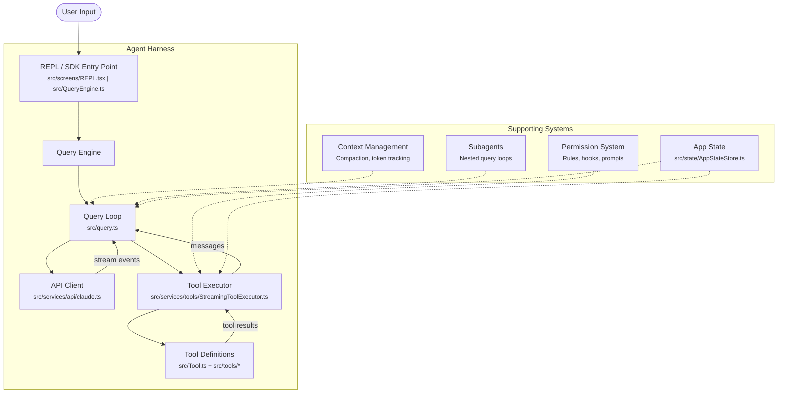

# What Makes a Harness Production-Grade

An agent harness is the runtime that orchestrates an LLM agent. At its core, the idea is almost disappointingly simple: call the model, look at what it wants to do, execute those actions, feed the results back, and repeat until the model says it's done.

```
while true:
    response = call_model(messages)
    if response.has_tool_calls():
        results = execute_tools(response.tool_calls)
        messages.append(results)
    else:
        break
```

You can build this in an afternoon. Many people have. The loop itself is maybe twenty lines of code in any language. And yet Claude Code — a production agent harness built on this same loop — is tens of thousands of lines of TypeScript. What are all those lines doing?

## The Deceptive Simplicity

The gap between a working prototype and a production system is not a smooth ramp — it's a cliff. The prototype works in the demo. The production system works at 3 AM when the network is flaky, the user hit Ctrl+C mid-operation, the model hallucinated a tool name that doesn't exist, and the context window is 98% full.

Every concern that you can wave away in a prototype becomes a load-bearing wall in production. Here are eight of them:

| Concern | Naive Approach | Production Requirement |
|-|-|-|
| **Error Recovery** | Crash or swallow the error | Construct a synthetic tool result so the model sees the failure and can adapt its strategy |
| **Streaming** | Wait for the full response, then act | Stream tokens to the UI in real-time while simultaneously parsing tool calls as they arrive |
| **Concurrency** | Execute tools one at a time | Run concurrency-safe tools in parallel, serialize destructive ones, abort siblings on failure |
| **Context Limits** | Hope the conversation fits | Monitor token usage, auto-compact when approaching limits, preserve critical context |
| **Permissions** | Run everything the model asks for | Check every tool call against permission rules, prompt the user when needed, deny silently when configured |
| **Observability** | `console.log` | Structured analytics, session tracing, cost tracking, API metrics per request |
| **Cancellation** | Kill the process | Propagate abort signals through nested controllers, clean up in-flight operations, yield partial results |
| **Resource Cleanup** | Let the OS handle it | Track file handles, child processes, MCP connections; ensure deterministic cleanup on every exit path |

Each row in this table is a chapter's worth of engineering. This course will walk through how Claude Code addresses each one, using the actual source code as our reference implementation.

## A Concrete Example: When a Tool Fails

Let's make this tangible. Suppose the model asks the harness to run two Bash commands in parallel:

1. `git status` (a read-only command)
2. `rm -rf /tmp/build && make` (a build command that fails because `make` isn't installed)

**In a toy harness**, one of two things happens. Either the error crashes the whole loop and the user sees a stack trace, or the error is silently swallowed and the model never learns that the build failed. Both outcomes are bad — the model can't adapt to what it can't see.

**In Claude Code**, the `StreamingToolExecutor` (in `src/services/tools/StreamingToolExecutor.ts`) handles this with a pattern called *sibling abort*:

1. Both tools start executing in parallel because the executor determined they are concurrency-safe.
2. The `rm -rf /tmp/build && make` command fails. The executor sets `hasErrored = true` and fires the `siblingAbortController`.
3. The still-running `git status` command receives the abort signal. Instead of crashing, it gets a **synthetic error message** — a fabricated `tool_result` block that says `"Cancelled: parallel tool call rm -rf /tmp/build && make errored"`.
4. Both tool results (the real error and the synthetic cancellation) are yielded back to the query loop as normal `UserMessage` objects.
5. The model sees both results in its next turn and can reason about what happened.

The key insight is that the model's view of the world must always be consistent. Every `tool_use` block the model emitted must have a corresponding `tool_result` block — even if that result is synthetic. The harness is responsible for maintaining this invariant, no matter what goes wrong at the execution layer.

```typescript
// src/services/tools/StreamingToolExecutor.ts
private createSyntheticErrorMessage(
  toolUseId: string,
  reason: 'sibling_error' | 'user_interrupted' | 'streaming_fallback',
  assistantMessage: AssistantMessage,
): Message {
  const desc = this.erroredToolDescription
  const msg = desc
    ? `Cancelled: parallel tool call ${desc} errored`
    : 'Cancelled: parallel tool call errored'
  return createUserMessage({
    content: [{
      type: 'tool_result',
      content: `<tool_use_error>${msg}</tool_use_error>`,
      is_error: true,
      tool_use_id: toolUseId,
    }],
    toolUseResult: msg,
    sourceToolAssistantUUID: assistantMessage.uuid,
  })
}
```

This is a microcosm of the production mindset: **failures are data, not exceptions**. The harness translates every failure mode into something the model can reason about.

## High-Level Architecture

Before we dive into the individual systems, here's how the major components of Claude Code fit together:



The flow moves left to right through three phases:

1. **Input** — The REPL (interactive mode) or QueryEngine (SDK/headless mode) accepts user input and constructs the initial message array.
2. **Query Loop** — `query()` in `src/query.ts` is an async generator that calls the API, streams the response, dispatches tool calls to the executor, collects results, and decides whether to continue or terminate.
3. **Tool Execution** — The `StreamingToolExecutor` manages concurrency, permissions, and error handling for each tool call, yielding results back to the query loop.

The supporting systems — context management, permissions, subagents, and application state — cut across all three phases. They're not sequential stages; they're cross-cutting concerns that the harness must coordinate at every step.

## Key Takeaways

- **The loop is the easy part.** The engineering challenge in a production agent harness is everything around the loop: error recovery, streaming, concurrency, permissions, observability, and resource management.

- **Failures are data, not exceptions.** A production harness translates every failure — tool errors, timeouts, cancellations, permission denials — into structured messages that the model can reason about. The model's conversation history must always be self-consistent.

- **The harness is an intermediary, not a passthrough.** It doesn't just shuttle messages between the user and the model. It actively manages the conversation: injecting system context, enforcing permissions, compacting history, and coordinating concurrent operations.

- **Cross-cutting concerns dominate the codebase.** Permission checking, abort signal propagation, state management, and observability touch nearly every module. Designing clean abstractions for these concerns is where most of the architectural work lives.

- **Study real systems.** The patterns in this course aren't theoretical — they come from a production harness handling real workloads. The source paths referenced throughout point to actual code you can read and trace.
