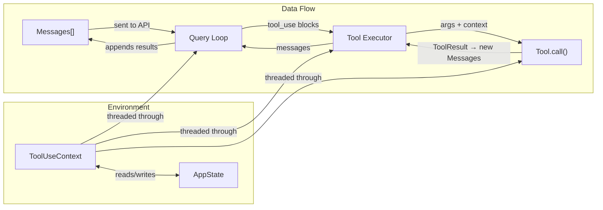

# Core Data Models

Every system has a small set of types that everything else is built on. In Claude Code, three types form the backbone: **Message** (what flows through the system), **Tool** (what the system can do), and **ToolUseContext** (the environment everything runs in). Understanding these three types is the key to reading the rest of the codebase.

## Messages: The Conversation as Data

The message array is the single most important data structure in an agent harness. It's the model's memory, the conversation history, the audit trail, and the primary interface between every subsystem. The model sees messages. Tools produce messages. The UI renders messages. Compaction rewrites messages.

You might expect a simple union — user messages and assistant messages, like the raw API types. But in a production system, many more things need to flow through the same pipeline. Here's the `Message` union type as imported throughout the codebase (from `src/types/message.js`):

```typescript
// The core message types used across the system
type Message =
  | UserMessage          // Human input OR tool results (both are "user" role)
  | AssistantMessage     // Model responses (text + tool_use blocks)
  | ProgressMessage      // Real-time updates from running tools
  | SystemMessage        // Harness-generated informational messages
  | TombstoneMessage     // Placeholder for removed/compacted messages
  | AttachmentMessage    // Files, images, context injected into the conversation
  | ToolUseSummaryMessage // Condensed summaries of completed tool calls
```

Why so many types? Because each represents a fundamentally different thing flowing through the system, and conflating them leads to bugs:

**`UserMessage`** carries both human input *and* tool results. This is an API constraint — the Anthropic API uses the `user` role for both. The `toolUseResult` field discriminates between them. The helper `isHumanTurn()` in `src/utils/messagePredicates.ts` exists precisely because checking `type === 'user'` alone is a common source of miscounting bugs.

**`AssistantMessage`** wraps the model's response, including text content, thinking blocks, and `tool_use` blocks. It also carries metadata like `apiError` (e.g., `'max_output_tokens'`) that lets the query loop distinguish between a normal stop and a truncation that needs recovery.

**`ProgressMessage`** is a real-time channel. While a tool is executing, it can emit progress updates — Bash commands stream their stdout, search tools report partial results, agents report their activity. These are rendered by the UI but stripped before sending messages to the API.

**`SystemMessage`** is a family of subtypes, each representing a different kind of harness-generated event:

| System Message Subtype | Purpose |
|-|-|
| `SystemInformationalMessage` | General status updates shown in the UI |
| `SystemAPIErrorMessage` | API errors (rate limits, overload) surfaced to the user |
| `SystemCompactBoundaryMessage` | Marks where context compaction occurred |
| `SystemMemorySavedMessage` | Confirmation that a memory was persisted |
| `SystemStopHookSummaryMessage` | Results from post-turn hook execution |
| `SystemLocalCommandMessage` | Output from slash commands (UI-only, stripped before API calls) |
| `SystemAgentsKilledMessage` | Notification that background agents were terminated |

**`TombstoneMessage`** replaces messages that were removed during compaction. Instead of deleting them (which would shift indices and break references), the system leaves a tombstone that the UI can skip and the API normalization layer can filter out.

**`AttachmentMessage`** carries context injected into the conversation — CLAUDE.md files, hook outputs, memory files. These are inserted at specific points in the message array and included in API calls as additional context.

## Tools: Capabilities with Metadata

A tool in a toy harness is a name, a function, and maybe a description. In Claude Code, a `Tool` (defined in `src/Tool.ts`) carries extensive metadata that the harness uses for permission checking, concurrency control, UI rendering, and more.

Here are the ten most important fields and methods on the `Tool` type:

```typescript
// src/Tool.ts (simplified — the full type has ~40 members)
type Tool<Input, Output, Progress> = {
  readonly name: string
  readonly inputSchema: Input           // Zod schema for validation
  call(args, context, canUseTool, parentMessage, onProgress?):
    Promise<ToolResult<Output>>         // The actual execution
  description(input, options): Promise<string>
  isConcurrencySafe(input): boolean     // Can run in parallel?
  isReadOnly(input): boolean            // Does it modify anything?
  isDestructive?(input): boolean        // Is it irreversible?
  checkPermissions(input, context):
    Promise<PermissionResult>           // Tool-specific permission logic
  interruptBehavior?(): 'cancel' | 'block'
  maxResultSizeChars: number            // Budget for result content
}
```

Let's walk through why each of these matters:

**`name`** and **`inputSchema`** are straightforward — they define what the model calls and how inputs are validated. The schema uses Zod, which gives runtime validation with TypeScript type inference. When the model sends malformed input, the schema catches it before execution.

**`call`** is the execution function. Note it receives not just the parsed arguments but also the `ToolUseContext`, a `canUseTool` callback for requesting permissions, the parent `AssistantMessage` (for linking results back), and an optional progress callback. This rich signature means tools have full access to the harness environment.

**`description`** is a function, not a string. The description can vary based on the current input and context — a Bash tool might describe itself differently when the session is non-interactive.

**`isConcurrencySafe`** tells the `StreamingToolExecutor` whether this tool can run in parallel with other concurrent-safe tools. Read-only tools like `Grep` and `Glob` return `true`; tools that write files return `false`. This is a function of the *input* — `Bash("ls")` might be concurrent-safe while `Bash("rm -rf")` is not.

**`isReadOnly`** and **`isDestructive`** inform the permission system. Read-only tools can often be auto-approved; destructive tools (those performing irreversible operations) require explicit user consent.

**`checkPermissions`** contains tool-specific permission logic that runs alongside the general permission system. A tool might allow certain inputs unconditionally (e.g., `Read` for files in the project directory) while requiring approval for others (e.g., `Read` for files outside the project).

**`interruptBehavior`** controls what happens when the user submits a new message while the tool is running. `'cancel'` means abort the tool and discard its result; `'block'` means keep running and queue the new message. Long-running agent tools block by default; quick search tools cancel.

**`maxResultSizeChars`** is a budget mechanism. When a tool produces output larger than this limit, the result is persisted to disk and the model receives a truncated preview with a file path. This prevents a single verbose tool call from consuming the entire context window.

Tools are constructed through the `buildTool()` factory function, which fills in safe defaults for commonly-stubbed methods. This means every tool gets fail-closed defaults: `isConcurrencySafe` defaults to `false` (assume not safe), `isReadOnly` defaults to `false` (assume writes), `isDestructive` defaults to `false`. Tools opt in to less restrictive behavior — they don't opt out of safety.

## ToolUseContext: The Environment

If `Message` is what flows through the system and `Tool` is what the system can do, then `ToolUseContext` is *where* it happens. It's the ambient environment that gets threaded through the entire query loop and into every tool execution.

```typescript
// src/Tool.ts — ToolUseContext (key fields)
type ToolUseContext = {
  options: {
    tools: Tools                        // Available tool definitions
    commands: Command[]                 // Slash commands
    thinkingConfig: ThinkingConfig      // Extended thinking settings
    mcpClients: MCPServerConnection[]   // MCP server connections
    agentDefinitions: AgentDefinitionsResult  // Available agent types
    mainLoopModel: string               // Current model identifier
    debug: boolean
    verbose: boolean
    isNonInteractiveSession: boolean
  }
  abortController: AbortController      // Cancellation signal
  messages: Message[]                   // Current conversation state
  readFileState: FileStateCache          // Cached file contents
  getAppState(): AppState               // Read global state
  setAppState(f: (prev: AppState) => AppState): void  // Update global state
  agentId?: AgentId                     // Set for subagents only
  setInProgressToolUseIDs: (f: (prev: Set<string>) => Set<string>) => void
  updateFileHistoryState: (updater) => void
  updateAttributionState: (updater) => void
  contentReplacementState?: ContentReplacementState  // Tool result budget
}
```

A few things worth noting about this type:

**It carries both configuration and capabilities.** The `options` block holds immutable configuration (what model, what tools, what MCP servers). The methods (`getAppState`, `setAppState`, `setInProgressToolUseIDs`) provide capabilities — ways to interact with the broader system.

**It's the thread that connects the query loop to the state store.** `getAppState()` and `setAppState()` bridge into the reactive state system (`src/state/AppStateStore.ts`). When a tool needs to check permission settings, inspect MCP connections, or update the file history, it goes through the context.

**`abortController` is the cancellation backbone.** Every level of the system — the query loop, the streaming tool executor, individual tool calls — chains `AbortController` instances in a parent-child hierarchy. Aborting a parent cascades to all children. This is how user interruptions, sibling tool errors, and session termination propagate cleanly through deeply nested operations.

**Subagents get a modified copy.** When the harness spawns a subagent (a nested query loop for the `Agent` tool), it creates a derived `ToolUseContext` with its own `abortController`, `agentId`, and sometimes a no-op `setAppState` to isolate the subagent from the parent's state.

## AppState: The Global Picture

The `AppState` type (in `src/state/AppStateStore.ts`) holds the full application state — everything from tool permissions to MCP connections to UI preferences. It's wrapped in `DeepImmutable<>` to enforce immutable updates:

```typescript
// src/state/AppStateStore.ts (excerpt)
type AppState = DeepImmutable<{
  settings: SettingsJson
  verbose: boolean
  mainLoopModel: ModelSetting
  toolPermissionContext: ToolPermissionContext
  agent: string | undefined
  thinkingEnabled: boolean | undefined
  // ... many more fields
}> & {
  tasks: { [taskId: string]: TaskState }  // Excluded from DeepImmutable
  mcp: { clients, tools, commands, resources }
  plugins: { enabled, disabled, commands, errors }
  agentDefinitions: AgentDefinitionsResult
  fileHistory: FileHistoryState
  todos: { [agentId: string]: TodoList }
}
```

The `ToolUseContext` reads and writes `AppState` through its `getAppState`/`setAppState` methods, making the context the bridge between the stateless query loop and the stateful application shell.

## How the Types Relate



Messages flow in a cycle: the query loop sends them to the API, receives tool-use blocks, dispatches to tools via the executor, and appends the resulting messages back to the array. The `ToolUseContext` is threaded through every step, providing access to configuration, capabilities, and the global `AppState`.

## Key Takeaways

- **Messages are richer than API types.** A production harness needs progress events, system messages, tombstones, and attachments alongside the standard user/assistant messages. Each type exists because conflating them with simpler types caused real bugs.

- **Tools carry behavioral metadata, not just implementations.** Fields like `isConcurrencySafe`, `isDestructive`, `interruptBehavior`, and `maxResultSizeChars` let the harness make intelligent scheduling, permission, and resource decisions without understanding what each tool actually does.

- **Context is the environment, not just arguments.** The `ToolUseContext` bundles configuration, capabilities, cancellation signals, and state access into a single object threaded through the system. This avoids global state while giving every component access to what it needs.

- **Defaults are fail-closed.** The `buildTool()` factory defaults to "not concurrent-safe, not read-only" — the safe assumption. Tools explicitly opt into less restrictive behavior. This is a general principle worth adopting: make the safe path the default path.

- **Immutability is enforced at the type level.** `AppState` is wrapped in `DeepImmutable<>`, and updates go through `setAppState` with a reducer function. This prevents accidental mutation bugs that are notoriously hard to track down in systems with shared mutable state.
