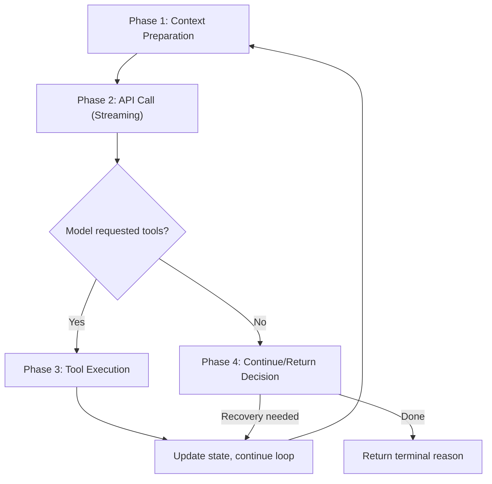

# The Main Loop

Let's trace a concrete interaction. A user types into the Claude Code REPL: "Create a file called hello.ts with a greeting function." What happens next?

The message enters the **query loop** -- the central heartbeat of the agent harness. This loop is deceptively simple in shape (`while (true) { ... }`) but carries the full weight of context management, streaming, tool execution, error recovery, and termination logic. Understanding this loop is understanding the agent.

## The Two Entry Points

The query system has two layers. The outer `query()` function is the public API -- it's what the REPL, the SDK, subagents, and background tasks all call. It delegates immediately to `queryLoop()`, wrapping it with lifecycle tracking for queued commands:

```typescript
// src/query.ts, line 219
export async function* query(
  params: QueryParams,
): AsyncGenerator<
  | StreamEvent
  | RequestStartEvent
  | Message
  | TombstoneMessage
  | ToolUseSummaryMessage,
  Terminal
> {
  const consumedCommandUuids: string[] = []
  const terminal = yield* queryLoop(params, consumedCommandUuids)
  for (const uuid of consumedCommandUuids) {
    notifyCommandLifecycle(uuid, 'completed')
  }
  return terminal
}
```

Both functions are **async generators** -- they yield messages as they arrive (streaming to the UI) and return a terminal reason when the turn is complete. This is a critical design choice: the caller doesn't wait for the entire turn to finish before seeing output.

## The While(true) Skeleton

Inside `queryLoop()`, the actual loop starts at line 307. Here's its simplified skeleton, stripped of the dozens of feature gates and edge cases:

```typescript
// src/query.ts, line 241-1729 (simplified)
async function* queryLoop(params, consumedCommandUuids) {
  // Immutable params — never reassigned during the loop
  const { systemPrompt, userContext, systemContext, canUseTool, ... } = params

  // Mutable state — reassigned as a complete object at each continue site
  let state: State = { messages: params.messages, turnCount: 1, ... }

  while (true) {
    const { messages, toolUseContext, turnCount, ... } = state

    // ── Phase 1: Context preparation ──────────────────────────
    let messagesForQuery = getMessagesAfterCompactBoundary(messages)
    messagesForQuery = await applyToolResultBudget(messagesForQuery, ...)
    // snip, microcompact, context collapse, autocompact...

    // ── Phase 2: API call (streaming) ─────────────────────────
    for await (const message of deps.callModel({ messages, systemPrompt, ... })) {
      // collect assistant messages, extract tool_use blocks
      yield message  // stream to UI in real time
    }

    // ── Phase 3: Tool execution ───────────────────────────────
    if (needsFollowUp) {
      for await (const update of toolUpdates) {
        yield update.message  // stream tool results to UI
      }
      // append tool results, check maxTurns
      state = { messages: [...messages, ...assistantMessages, ...toolResults], ... }
      continue  // loop again — model needs to see tool results
    }

    // ── Phase 4: Decision ─────────────────────────────────────
    // No tools requested — check stop hooks, recovery paths, budget
    return { reason: 'completed' }
  }
}
```

## The Four Phases

Each iteration of the loop follows four distinct phases:



### Phase 1: Context Preparation

Before each API call, the loop prepares the conversation context. This is where the harness earns its keep -- raw conversation history would blow past context limits within a few tool calls. The preparation pipeline runs in order:

1. **Tool result budget** -- enforces per-message size limits on tool outputs (`applyToolResultBudget`, line 379)
2. **Snip compaction** -- removes old, low-value messages from the middle of history (line 401)
3. **Microcompaction** -- compresses individual tool results that are too verbose (line 414)
4. **Context collapse** -- projects a collapsed view over archived conversation segments (line 440)
5. **Autocompaction** -- if the context is still too large, summarize the entire history (line 454)

Each step is optional and feature-gated. They compose cleanly because each operates on the output of the previous step.

### Phase 2: API Call (Streaming)

The model call happens inside a `for await` loop over `deps.callModel(...)` (line 659). Chunks arrive over 5-30 seconds. Each yielded message is:

- Immediately forwarded to the UI via `yield`
- Collected into `assistantMessages[]` if it's an assistant message
- Scanned for `tool_use` blocks, which are queued for execution

This is also where streaming tool execution begins -- if enabled, tools start running before the model finishes responding (more on this in Module 3).

### Phase 3: Tool Execution

If the model requested any tools (`needsFollowUp === true`), the loop executes them and collects their results. It then builds a new `State` object with the updated message history (original messages + assistant messages + tool results) and `continue`s the loop. The model will see the tool results on the next iteration and decide what to do next.

### Phase 4: Continue/Return Decision

If the model did *not* request tools, we've reached a potential stopping point. But "no tools" doesn't necessarily mean "we're done." The loop checks a cascade of recovery and continuation conditions:

- Was the response cut short by output token limits?
- Did a stop hook block the response?
- Does the token budget allow continuing?
- Did a 413 error occur that compaction can recover from?

Each of these can cause the loop to `continue` with a new state. Only when none of them fire does the loop `return { reason: 'completed' }`. We'll explore this decision tree in detail in the [Continue/Return Decision Tree](./04-continue-decision-tree.md) section.

## How the REPL Consumes This

The beauty of the async generator pattern is that the consumer is simple. Here's the core of the REPL's consumption loop:

```typescript
// src/screens/REPL.tsx, line 2793
for await (const event of query({
  messages: messagesIncludingNewMessages,
  systemPrompt,
  userContext,
  ...
})) {
  // Each event is rendered to the terminal UI as it arrives
  // Assistant text streams character by character
  // Tool results appear as they complete
}
```

The same `query()` function serves the REPL, the SDK (`QueryEngine.ts`, line 675), subagents (`runAgent.ts`, line 748), background sessions (`LocalMainSessionTask.ts`, line 383), and hook-spawned agents (`execAgentHook.ts`, line 167). The generator protocol means each consumer can process events at its own pace -- the REPL renders them, the SDK forwards them to callers, subagents collect them for summarization.

## Key Takeaways

- **The query loop is a `while(true)` async generator** that yields messages as they stream and returns a terminal reason when the turn ends.
- **Four phases per iteration**: context preparation, API call, tool execution, and the continue/return decision.
- **The async generator protocol** decouples production (the loop) from consumption (REPL, SDK, subagents). Each consumer iterates at its own pace.
- **Context preparation is a multi-stage pipeline** (budget, snip, microcompact, collapse, autocompact) that runs before every API call, ensuring the context stays within limits even across long tool-use chains.
- **State is carried between iterations** as a single mutable `State` object, reassigned atomically at each `continue` site -- a pattern we'll examine in detail next.
