# State Management with Explicit Transitions

The query loop carries mutable state between iterations. This is inherently dangerous -- a `while(true)` loop with 9 mutable variables and 7+ different reasons to `continue` is a recipe for subtle, hard-to-reproduce bugs. The Claude Code codebase addresses this with a pattern that's worth studying: **explicit state transitions**.

## The Problem

Consider a naive approach where each piece of state is a separate `let` variable at the top of the loop. Every `continue` site would need to remember which subset of variables to update. Miss one? You get stale state on the next iteration. Update one incorrectly? The bug might not manifest until three iterations later, under a specific combination of error recovery and tool execution.

With 7 different `continue` sites and 9 state variables, that's 63 potential mutation sites -- each one a chance to introduce a bug that only appears under production load.

## The State Type

The solution is a single `State` type that bundles all mutable cross-iteration state:

```typescript
// src/query.ts, line 204-217
type State = {
  messages: Message[]
  toolUseContext: ToolUseContext
  autoCompactTracking: AutoCompactTrackingState | undefined
  maxOutputTokensRecoveryCount: number
  hasAttemptedReactiveCompact: boolean
  maxOutputTokensOverride: number | undefined
  pendingToolUseSummary: Promise<ToolUseSummaryMessage | null> | undefined
  stopHookActive: boolean | undefined
  turnCount: number
  // Why the previous iteration continued. Undefined on first iteration.
  transition: Continue | undefined
}
```

This type is initialized once at the start of the loop:

```typescript
// src/query.ts, line 268-279
let state: State = {
  messages: params.messages,
  toolUseContext: params.toolUseContext,
  maxOutputTokensOverride: params.maxOutputTokensOverride,
  autoCompactTracking: undefined,
  stopHookActive: undefined,
  maxOutputTokensRecoveryCount: 0,
  hasAttemptedReactiveCompact: false,
  turnCount: 1,
  pendingToolUseSummary: undefined,
  transition: undefined,
}
```

At the top of each iteration, the state is destructured into local variables:

```typescript
// src/query.ts, line 311-321
let { toolUseContext } = state
const {
  messages,
  autoCompactTracking,
  maxOutputTokensRecoveryCount,
  hasAttemptedReactiveCompact,
  maxOutputTokensOverride,
  pendingToolUseSummary,
  stopHookActive,
  turnCount,
} = state
```

## The Pattern: Complete State at Every Continue

The key discipline: every `continue` site writes a **complete** new `State` object. No partial updates. No "just tweak this one field." Here are three real examples from the codebase:

### Example 1: Max Output Tokens Recovery (line 1231)

When the model's response is truncated by output token limits, the loop injects a "resume" message and tries again:

```typescript
// src/query.ts, line 1231-1251
const next: State = {
  messages: [
    ...messagesForQuery,
    ...assistantMessages,
    recoveryMessage,
  ],
  toolUseContext,
  autoCompactTracking: tracking,
  maxOutputTokensRecoveryCount: maxOutputTokensRecoveryCount + 1,
  hasAttemptedReactiveCompact,
  maxOutputTokensOverride: undefined,
  pendingToolUseSummary: undefined,
  stopHookActive: undefined,
  turnCount,
  transition: {
    reason: 'max_output_tokens_recovery',
    attempt: maxOutputTokensRecoveryCount + 1,
  },
}
state = next
continue
```

Every field is explicitly set. `maxOutputTokensRecoveryCount` increments. `pendingToolUseSummary` resets to `undefined`. Nothing is accidentally carried forward.

### Example 2: Reactive Compact Retry (line 1152)

When a 413 (prompt too long) error occurs and reactive compaction succeeds in freeing space:

```typescript
// src/query.ts, line 1152-1165
const next: State = {
  messages: postCompactMessages,
  toolUseContext,
  autoCompactTracking: undefined,
  maxOutputTokensRecoveryCount,
  hasAttemptedReactiveCompact: true,
  maxOutputTokensOverride: undefined,
  pendingToolUseSummary: undefined,
  stopHookActive: undefined,
  turnCount,
  transition: { reason: 'reactive_compact_retry' },
}
state = next
continue
```

Notice: `hasAttemptedReactiveCompact` is set to `true` -- this is a one-shot guard. If the retry still 413s, the loop won't attempt reactive compaction again. `autoCompactTracking` resets because compaction just ran.

### Example 3: Stop Hook Blocking (line 1283)

When a stop hook rejects the model's response and injects error messages for the model to see:

```typescript
// src/query.ts, line 1283-1305
const next: State = {
  messages: [
    ...messagesForQuery,
    ...assistantMessages,
    ...stopHookResult.blockingErrors,
  ],
  toolUseContext,
  autoCompactTracking: tracking,
  maxOutputTokensRecoveryCount: 0,
  hasAttemptedReactiveCompact,
  pendingToolUseSummary: undefined,
  stopHookActive: true,
  turnCount,
  transition: { reason: 'stop_hook_blocking' },
  maxOutputTokensOverride: undefined,
}
state = next
continue
```

Here, `maxOutputTokensRecoveryCount` resets to 0 (a new model response starts fresh), but `hasAttemptedReactiveCompact` is preserved. The comment in the source explains why: resetting it here caused an infinite loop where compaction would fire, fail to shrink enough, trigger a stop hook, reset the guard, and compact again endlessly.

## The Transition Field

The most interesting field in `State` is `transition`. It records **why** the previous iteration continued. This serves three purposes:

### 1. Preventing Infinite Loops

The loop checks the previous transition to avoid repeating a recovery that already failed:

```typescript
// src/query.ts, line 1092
if (
  feature('CONTEXT_COLLAPSE') &&
  contextCollapse &&
  state.transition?.reason !== 'collapse_drain_retry'
) {
  const drained = contextCollapse.recoverFromOverflow(...)
```

If the last iteration was already a `collapse_drain_retry` and we're seeing another 413, don't try collapse again -- fall through to reactive compact instead.

### 2. Making Control Flow Auditable

Each transition carries a descriptive `reason` string: `'next_turn'`, `'reactive_compact_retry'`, `'max_output_tokens_recovery'`, `'stop_hook_blocking'`, `'collapse_drain_retry'`, `'max_output_tokens_escalate'`, `'token_budget_continuation'`. Logging these creates a readable trace of the loop's decision-making.

### 3. Self-Documenting Continue Sites

Every `continue` site declares its intent. You don't need to read the surrounding 50 lines of context to understand why the loop continued -- the transition reason tells you directly.

## State Transition Diagram

```mermaid
stateDiagram-v2
    [*] --> Running: Initial state (transition: undefined)

    Running --> next_turn: Tool results ready
    Running --> collapse_drain_retry: 413, collapses freed space
    Running --> reactive_compact_retry: 413, summarization freed space
    Running --> max_output_tokens_escalate: Output capped, retry at 64k
    Running --> max_output_tokens_recovery: Output capped, inject resume
    Running --> stop_hook_blocking: Hook rejected response
    Running --> token_budget_continuation: Budget remaining, nudge model

    next_turn --> Running
    collapse_drain_retry --> Running
    reactive_compact_retry --> Running
    max_output_tokens_escalate --> Running
    max_output_tokens_recovery --> Running
    stop_hook_blocking --> Running
    token_budget_continuation --> Running

    Running --> completed: No tools, no recovery needed
    Running --> aborted_streaming: User interrupted during streaming
    Running --> prompt_too_long: 413 with no recovery available
    Running --> image_error: Unrecoverable media error
    Running --> model_error: API/runtime error
    Running --> stop_hook_prevented: Hook blocked permanently
    Running --> max_turns: Turn limit exceeded
    Running --> blocking_limit: Context at hard limit
```



## Why This Matters

This pattern -- complete state objects at every transition point, with an explicit reason field -- is not the most concise way to write a loop. You could save lines by mutating individual variables. But the tradeoffs favor explicitness:

**Prevention of stale state**: When you must write every field, TypeScript catches omissions at compile time. Add a new field to `State`? Every `continue` site becomes a type error until you handle it.

**Auditability**: The transition reason creates a log-friendly breadcrumb trail. When a user reports "the agent looped 47 times and burned my tokens," the transition history tells you exactly what recovery path misfired.

**Testability**: Tests can assert on `state.transition?.reason` without parsing message contents. "Did the max-output-tokens recovery fire?" becomes a simple string comparison.

**Protection against infinite loops**: The transition field gives each `continue` site the information it needs to detect "I already tried this." Without it, you'd need separate boolean flags for each recovery path -- which is exactly the scattered-mutation problem the pattern exists to prevent.

## Key Takeaways

- **The query loop bundles all mutable state into a single `State` type** with 9 fields, rather than using separate `let` variables for each piece of state.
- **Every `continue` site writes a complete new `State` object** -- no partial updates, no implicit carryover. TypeScript enforces that no field is forgotten.
- **The `transition` field records why the loop continued**, enabling infinite-loop prevention, auditing, and self-documenting control flow.
- **This pattern trades brevity for safety** -- each continue site is ~15 lines of explicit state, but the alternative (scattered mutations across 7 continue sites and 9 variables) is measurably more error-prone.
