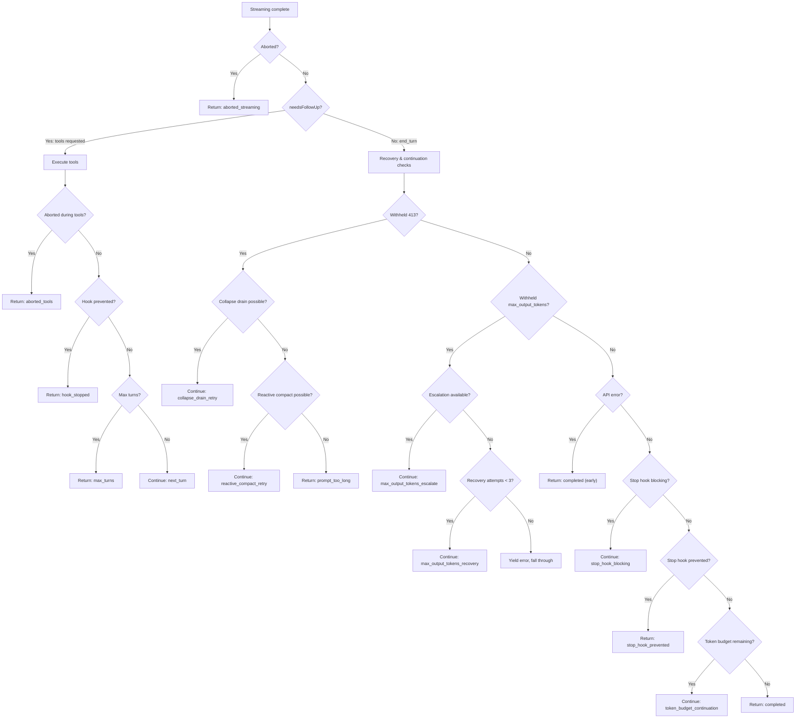

# The Continue/Return Decision Tree

After the API response finishes streaming and tool execution completes, the query loop faces its most consequential decision: should it loop again, or return control to the caller?

This decision is not a single `if/else`. It's a cascade of checks, each with its own conditions, recovery logic, and failure modes. Understanding this cascade is essential for debugging agent behavior -- when a user reports "the agent kept going when it should have stopped" or "the agent stopped when it should have continued," the answer is somewhere in this tree.

## The Two Branches

The decision tree has a fundamental fork: did the model request tools, or didn't it?



## The Continue Reasons

Let's walk through each reason the loop might continue, in the order the code checks them.

### 1. Normal tool execution (`next_turn`)

The most common case. The model requested one or more tools, tools ran and produced results, and the model needs to see those results to decide what to do next.

```typescript
// src/query.ts, line 1715-1727
const next: State = {
  messages: [...messagesForQuery, ...assistantMessages, ...toolResults],
  toolUseContext: toolUseContextWithQueryTracking,
  autoCompactTracking: tracking,
  turnCount: nextTurnCount,
  maxOutputTokensRecoveryCount: 0,
  hasAttemptedReactiveCompact: false,
  pendingToolUseSummary: nextPendingToolUseSummary,
  maxOutputTokensOverride: undefined,
  stopHookActive,
  transition: { reason: 'next_turn' },
}
state = next
```

Note that `maxOutputTokensRecoveryCount` and `hasAttemptedReactiveCompact` both reset. A new model turn gets a fresh set of recovery attempts.

### 2. Context collapse drain retry (`collapse_drain_retry`)

When the API returns a 413 (prompt too long), the first recovery attempt is to drain any staged context collapses. Context collapse archives old conversation segments into summaries; "draining" means committing those staged archives to free space.

This is gated on the previous transition not being `collapse_drain_retry` -- if we already drained and still got a 413, fall through to the next recovery tier:

```typescript
// src/query.ts, line 1089-1116
if (
  feature('CONTEXT_COLLAPSE') &&
  contextCollapse &&
  state.transition?.reason !== 'collapse_drain_retry'
) {
  const drained = contextCollapse.recoverFromOverflow(messagesForQuery, querySource)
  if (drained.committed > 0) {
    state = { ..., transition: { reason: 'collapse_drain_retry', committed: drained.committed } }
    continue
  }
}
```

### 3. Reactive compact retry (`reactive_compact_retry`)

If context collapse didn't free enough space (or isn't enabled), the loop tries reactive compaction -- a full conversation summarization triggered by the error, rather than proactively before the API call. This is also the recovery path for media size errors (oversized images/PDFs).

This is a one-shot recovery: `hasAttemptedReactiveCompact` is set to `true` on the new state, preventing a spiral. If the compacted context still 413s, the error surfaces to the user.

```typescript
// src/query.ts, line 1119-1165
if ((isWithheld413 || isWithheldMedia) && reactiveCompact) {
  const compacted = await reactiveCompact.tryReactiveCompact({
    hasAttempted: hasAttemptedReactiveCompact,
    messages: messagesForQuery,
    ...
  })
  if (compacted) {
    state = {
      ...,
      hasAttemptedReactiveCompact: true,
      transition: { reason: 'reactive_compact_retry' },
    }
    continue
  }
  // No recovery — surface the withheld error and exit
  yield lastMessage
  return { reason: isWithheldMedia ? 'image_error' : 'prompt_too_long' }
}
```

### 4. Max output tokens escalation (`max_output_tokens_escalate`)

When the model's response hits the output token cap, the first thing the loop tries is escalation: if the current cap was the default (lower) limit and no override was set, retry the same request with a higher limit (`ESCALATED_MAX_TOKENS`, typically 64k). This fires once per turn:

```typescript
// src/query.ts, line 1199-1220
if (
  capEnabled &&
  maxOutputTokensOverride === undefined &&
  !process.env.CLAUDE_CODE_MAX_OUTPUT_TOKENS
) {
  state = {
    ...,
    maxOutputTokensOverride: ESCALATED_MAX_TOKENS,
    transition: { reason: 'max_output_tokens_escalate' },
  }
  continue
}
```

### 5. Max output tokens recovery (`max_output_tokens_recovery`)

If escalation wasn't available or didn't help, the loop injects a meta message telling the model to resume where it left off, and retries. This happens up to 3 times (`MAX_OUTPUT_TOKENS_RECOVERY_LIMIT`):

```typescript
// src/query.ts, line 1223-1251
if (maxOutputTokensRecoveryCount < MAX_OUTPUT_TOKENS_RECOVERY_LIMIT) {
  const recoveryMessage = createUserMessage({
    content:
      `Output token limit hit. Resume directly — no apology, no recap ` +
      `of what you were doing. Pick up mid-thought if that is where the ` +
      `cut happened. Break remaining work into smaller pieces.`,
    isMeta: true,
  })
  state = {
    ...,
    maxOutputTokensRecoveryCount: maxOutputTokensRecoveryCount + 1,
    transition: { reason: 'max_output_tokens_recovery', attempt: ... },
  }
  continue
}
```

After 3 attempts, the withheld error is yielded and the loop falls through to the return path.

### 6. Stop hook blocking (`stop_hook_blocking`)

Stop hooks run after the model produces a response without tool calls. If a hook rejects the response (e.g., a linting hook detects that the model's code changes broke the build), the hook's error messages are appended to the conversation and the model gets another chance:

```typescript
// src/query.ts, line 1282-1305
if (stopHookResult.blockingErrors.length > 0) {
  state = {
    ...,
    messages: [...messagesForQuery, ...assistantMessages, ...stopHookResult.blockingErrors],
    stopHookActive: true,
    transition: { reason: 'stop_hook_blocking' },
  }
  continue
}
```

### 7. Token budget continuation (`token_budget_continuation`)

When the user or SDK provides a token budget and the model hasn't exhausted it, the loop injects a nudge message encouraging the model to continue working:

```typescript
// src/query.ts, line 1308-1340
if (feature('TOKEN_BUDGET')) {
  const decision = checkTokenBudget(budgetTracker!, ...)
  if (decision.action === 'continue') {
    state = {
      ...,
      messages: [...messagesForQuery, ...assistantMessages, createUserMessage({
        content: decision.nudgeMessage,
        isMeta: true,
      })],
      transition: { reason: 'token_budget_continuation' },
    }
    continue
  }
}
```

## The Return Reasons

When none of the continue conditions fire, the loop returns a `Terminal` object. Here are all the terminal reasons:

| Reason | When | Line |
|-|-|-|
| `completed` | Normal completion -- model stopped without requesting tools, no recovery needed | 1357 |
| `completed` (early) | API error on final message -- skip stop hooks to prevent death spiral | 1264 |
| `aborted_streaming` | User interrupted during model streaming (Ctrl+C) | 1051 |
| `aborted_tools` | User interrupted during tool execution | 1515 |
| `prompt_too_long` | 413 error with no recovery available | 1175 |
| `image_error` | Unrecoverable media size error, or image processing failure | 977, 1175 |
| `blocking_limit` | Context at hard blocking limit (auto-compact disabled) | 647 |
| `model_error` | Uncaught exception from the API layer | 996 |
| `stop_hook_prevented` | Stop hook permanently blocked continuation | 1279 |
| `hook_stopped` | Tool execution hook prevented continuation | 1520 |
| `max_turns` | Turn limit exceeded (SDK/subagent safety valve) | 1711 |

## Model Fallback

There's one more retry path that operates at a different level: model fallback. This happens inside the streaming loop (not after it), when the API layer throws a `FallbackTriggeredError`:

```typescript
// src/query.ts, line 894-953
} catch (innerError) {
  if (innerError instanceof FallbackTriggeredError && fallbackModel) {
    currentModel = fallbackModel
    attemptWithFallback = true

    // Clear all accumulated state from the failed attempt
    yield* yieldMissingToolResultBlocks(assistantMessages, 'Model fallback triggered')
    assistantMessages.length = 0
    toolResults.length = 0

    // Strip thinking signatures — model-bound, would 400 on fallback
    if (process.env.USER_TYPE === 'ant') {
      messagesForQuery = stripSignatureBlocks(messagesForQuery)
    }

    yield createSystemMessage(
      `Switched to ${renderModelName(innerError.fallbackModel)} due to high demand...`,
      'warning',
    )
    continue  // retry the inner while(attemptWithFallback) loop
  }
  throw innerError
}
```

Fallback differs from the other recovery paths: it retries the entire streaming request with a different model, rather than modifying the conversation and re-entering the outer `while(true)` loop. It resets all accumulated state (assistant messages, tool results, tool blocks) and re-creates the `StreamingToolExecutor`, because the fallback model's response will have entirely different tool_use IDs.

## The Death Spiral Problem

Several of the return conditions exist specifically to prevent **death spirals** -- infinite loops where recovery attempts make the problem worse. The code comments call these out explicitly:

- **Stop hooks on API errors** (line 1258-1264): If the model returned an error, don't run stop hooks. The hook would see an error message, block it, the model would see the block, produce another error, and the cycle repeats.
- **Reactive compact after stop hooks** (line 1292-1296): `hasAttemptedReactiveCompact` is preserved across stop hook retries. If compaction ran and couldn't shrink enough, retrying after a stop hook would produce the same 413 endlessly.
- **Collapse drain guard** (line 1092): Checked via `state.transition?.reason !== 'collapse_drain_retry'` -- if the last iteration was already a drain retry, don't try again.

These guards are the kind of thing that's easy to overlook in a code review but critical in production, where a single unguarded recovery path can burn thousands of API calls in minutes.

## Key Takeaways

- **The decision tree has 7 continue reasons and 10+ return reasons**, each with specific conditions and guards against infinite loops.
- **Recovery is tiered**: 413 errors try collapse drain first (cheap), then reactive compact (expensive). Output token limits try escalation first (free), then multi-turn recovery (up to 3 attempts).
- **Model fallback operates at the streaming level**, not the outer loop level -- it retries the entire API request with a different model, clearing all accumulated state.
- **Death spiral prevention is a first-class concern**: every recovery path has explicit guards (one-shot booleans, transition reason checks, attempt counters) to prevent infinite loops.
- **The terminal reason is the loop's contract with its caller**: it tells the REPL, SDK, or subagent exactly why the turn ended, enabling appropriate error handling and user messaging at each layer.
