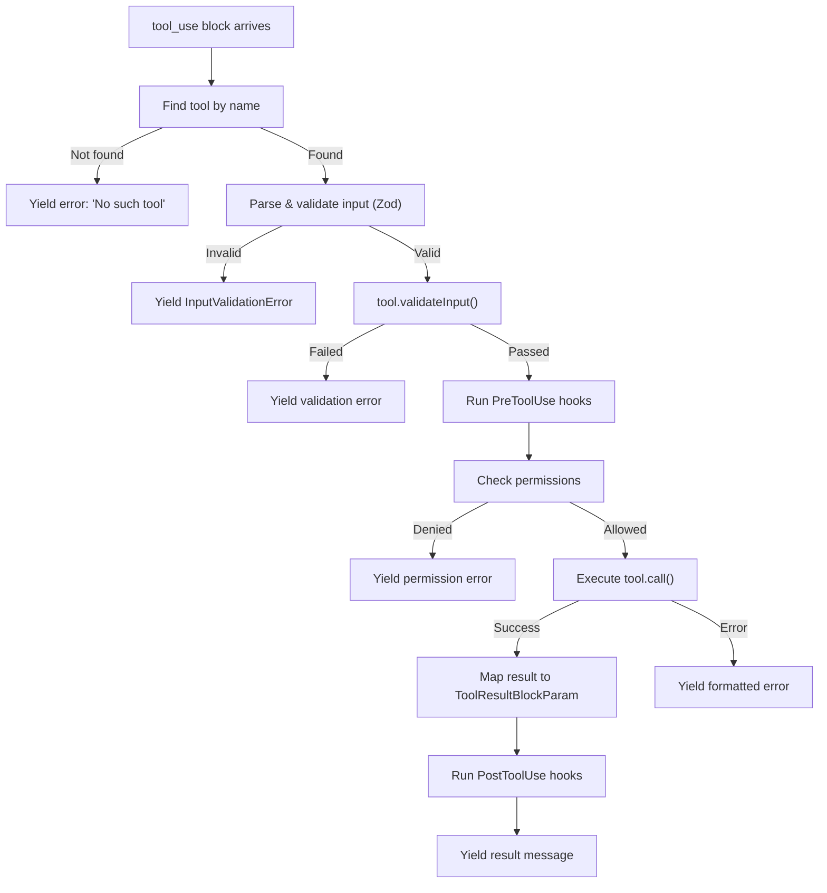

# Tool Execution Lifecycle

When the model emits a `tool_use` block, a lot happens before the result makes it back into the conversation. The execution pipeline in Claude Code is not just "call the function" -- it is a multi-phase process that validates, authorizes, executes, and post-processes every tool invocation. Understanding these phases is essential for building a robust agent harness.

## The Full Lifecycle

Here is the complete path a tool invocation follows, from the moment the API response arrives to the moment the result is yielded back into the message stream:



Let's walk through each phase.

## Phase 1: Tool Resolution

The first step is finding the tool definition by name. The `runToolUse` function in `src/services/tools/toolExecution.ts` handles this:

```typescript
// src/services/tools/toolExecution.ts (lines 337-356)
export async function* runToolUse(
  toolUse: ToolUseBlock,
  assistantMessage: AssistantMessage,
  canUseTool: CanUseToolFn,
  toolUseContext: ToolUseContext,
): AsyncGenerator<MessageUpdateLazy, void> {
  const toolName = toolUse.name
  let tool = findToolByName(toolUseContext.options.tools, toolName)

  // If not found, check if it's a deprecated tool being called by alias
  if (!tool) {
    const fallbackTool = findToolByName(getAllBaseTools(), toolName)
    if (fallbackTool && fallbackTool.aliases?.includes(toolName)) {
      tool = fallbackTool
    }
  }
  // ...
}
```

The alias fallback is a production detail worth noting: when tools get renamed, old conversation transcripts may still reference the original name. Rather than breaking replay, the system checks aliases.

## Phase 2: Input Validation

If the tool exists, its input is validated through two layers. First, the Zod schema:

```typescript
// src/services/tools/toolExecution.ts (lines 614-616)
const parsedInput = tool.inputSchema.safeParse(input)
if (!parsedInput.success) {
  let errorContent = formatZodValidationError(tool.name, parsedInput.error)
  // ...
}
```

Then, the tool-specific `validateInput` method:

```typescript
// src/services/tools/toolExecution.ts (lines 683-688)
const isValidCall = await tool.validateInput?.(parsedInput.data, toolUseContext)
if (isValidCall?.result === false) {
  // Yield validation error message
}
```

This two-layer approach separates structural validation (does the input have the right shape?) from semantic validation (does the file path exist? is the pattern valid?). The Zod layer catches type mismatches -- surprisingly common even with well-prompted models. The `validateInput` layer catches domain-specific issues.

## Phase 3: PreToolUse Hooks

Before permission checks happen, the system runs PreToolUse hooks. These are user-configurable hooks defined in `.claude/settings.json` that can inspect, modify, or block tool calls:

```typescript
// src/services/tools/toolExecution.ts (lines 800-862)
for await (const result of runPreToolUseHooks(
  toolUseContext, tool, processedInput, toolUseID, /* ... */
)) {
  switch (result.type) {
    case 'hookPermissionResult':
      hookPermissionResult = result.hookPermissionResult
      break
    case 'hookUpdatedInput':
      processedInput = result.updatedInput
      break
    case 'preventContinuation':
      shouldPreventContinuation = result.shouldPreventContinuation
      break
    case 'stop':
      // Abort the tool call entirely
      return resultingMessages
  }
}
```

Hooks can do four things: provide a permission decision (overriding the normal permission flow), modify the input, prevent continuation after this tool, or stop the tool entirely. This is the extensibility point where organizations can inject their own policies -- linting commands before they run, adding audit logging, enforcing file-path restrictions beyond what the built-in system provides.

## Phase 4: Permission Decision

After hooks have had their say, the system resolves the final permission decision. This combines the hook's recommendation (if any) with the tool's own `checkPermissions` and the general permission system:

```typescript
// src/services/tools/toolExecution.ts (lines 918-931)
const permissionMode = toolUseContext.getAppState().toolPermissionContext.mode

const resolved = await resolveHookPermissionDecision(
  hookPermissionResult,
  tool,
  processedInput,
  toolUseContext,
  canUseTool,
  assistantMessage,
  toolUseID,
)
const permissionDecision = resolved.decision
```

If permission is denied, the pipeline stops and yields an error message back to the model. If allowed, execution proceeds.

## Phase 5: Tool Execution

With validation passed and permission granted, the tool's `call` method runs:

```typescript
// src/services/tools/toolExecution.ts (lines 1207-1222)
const result = await tool.call(
  callInput,
  {
    ...toolUseContext,
    toolUseId: toolUseID,
    userModified: permissionDecision.userModified ?? false,
  },
  canUseTool,
  assistantMessage,
  progress => {
    onToolProgress({
      toolUseID: progress.toolUseID,
      data: progress.data,
    })
  },
)
```

The `onProgress` callback is how tools communicate intermediate status. A bash tool uses it to stream stdout lines as they arrive. A subagent tool uses it to relay its inner tool calls. These progress events are pushed into the message stream so the UI can update in real time.

## Phase 6: Result Mapping

The raw tool result must be converted to the API's `ToolResultBlockParam` format:

```typescript
// src/services/tools/toolExecution.ts (lines 1292-1296)
const mappedToolResultBlock = tool.mapToolResultToToolResultBlockParam(
  result.data,
  toolUseID,
)
```

This is where the tool decides what the model sees. A grep tool might format file paths and match counts. A file-read tool might include line numbers. The mapped result then passes through `processToolResultBlock`, which handles the result size budget -- if the result exceeds `maxResultSizeChars`, it gets persisted to disk and the model receives a truncated preview with a file path instead.

## Phase 7: PostToolUse Hooks

After execution succeeds, PostToolUse hooks run. These can modify the output, add additional context, or trigger side effects:

```typescript
// src/services/tools/toolExecution.ts (lines 1397-1401)
let toolOutput = result.data
const hookResults = []
const toolContextModifier = result.contextModifier
const mcpMeta = result.mcpMeta
```

PostToolUse hooks receive the tool output and can alter it before it becomes the final result message. They are the mirror image of PreToolUse hooks -- where PreToolUse modifies inputs and gates execution, PostToolUse modifies outputs and triggers follow-up actions.

## Context Modifiers

One subtle but important mechanism: `tool.call()` can return a `contextModifier` function alongside its data:

```typescript
// src/Tool.ts (lines 321-336)
export type ToolResult<T> = {
  data: T
  newMessages?: (UserMessage | AssistantMessage | AttachmentMessage | SystemMessage)[]
  contextModifier?: (context: ToolUseContext) => ToolUseContext
}
```

A context modifier updates the `ToolUseContext` for all subsequent tool calls in the same turn. This is how a tool can change the working directory, update file state caches, or modify other shared state. Importantly, context modifiers are **only honored for tools that are not concurrency-safe** -- concurrent tools would race on state updates.

## Error Handling

Errors at each phase are classified and formatted differently:

- **Tool not found**: wrapped in `<tool_use_error>` with the tool name
- **Input validation failure**: Zod errors are formatted with field-level detail, plus a hint to use ToolSearch if the schema was deferred
- **Semantic validation failure**: the tool's own error message
- **Permission denied**: includes the rejection reason, with optional image content blocks for visual diff rejections
- **Execution errors**: caught, logged, and formatted as `<tool_use_error>` blocks
- **Abort/cancellation**: generates a special cancel message so the model knows the tool was interrupted, not that it failed

This classification matters because the model needs to understand *why* a tool call failed to adjust its behavior. A permission denial is different from a missing file, which is different from a timeout.

## Key Takeaways

- **Tool execution is a seven-phase pipeline**: resolution, input validation, pre-hooks, permission check, execution, result mapping, and post-hooks. Each phase can halt the pipeline.
- **Hooks provide extensibility** at both the input (PreToolUse) and output (PostToolUse) boundaries, allowing organizations to inject custom policies without modifying tool code.
- **The `onProgress` callback** lets tools stream incremental updates during long operations, keeping the UI responsive.
- **Context modifiers** are a mechanism for tools to influence the environment for subsequent tool calls, but they are restricted to non-concurrent tools to avoid race conditions.
- **Error classification is deliberate** -- different failure modes produce different error formats so the model can reason about what went wrong.
