# Tool Concurrency

When a model emits multiple tool calls in a single turn, a naive implementation has two choices: run them all sequentially (slow) or run them all in parallel (dangerous). Neither is acceptable for a production agent. Sequential execution wastes time on independent reads. Unrestricted parallel execution risks race conditions when tools modify shared state. Claude Code solves this with a partitioning strategy that batches tools based on their safety properties.

## The Problem

Consider a typical model response that requests five tool calls:

1. Read file A
2. Read file B
3. Read file C
4. Bash: `npm test`
5. Read file D

Running these one at a time means the three file reads -- which are completely independent -- wait on each other for no reason. But running everything in parallel means `npm test` (which may modify `node_modules`, generate lock files, or write test output) races against the file reads. And if a subsequent tool depends on the bash command's side effects, parallel execution produces wrong results.

## The Partitioning Strategy

The solution lives in `src/services/tools/toolOrchestration.ts`. The `partitionToolCalls` function groups consecutive tool calls into batches:

```typescript
// src/services/tools/toolOrchestration.ts (lines 91-116)
function partitionToolCalls(
  toolUseMessages: ToolUseBlock[],
  toolUseContext: ToolUseContext,
): Batch[] {
  return toolUseMessages.reduce((acc: Batch[], toolUse) => {
    const tool = findToolByName(toolUseContext.options.tools, toolUse.name)
    const parsedInput = tool?.inputSchema.safeParse(toolUse.input)
    const isConcurrencySafe = parsedInput?.success
      ? (() => {
          try {
            return Boolean(tool?.isConcurrencySafe(parsedInput.data))
          } catch {
            return false
          }
        })()
      : false
    if (isConcurrencySafe && acc[acc.length - 1]?.isConcurrencySafe) {
      acc[acc.length - 1]!.blocks.push(toolUse)
    } else {
      acc.push({ isConcurrencySafe, blocks: [toolUse] })
    }
    return acc
  }, [])
}
```

The logic is straightforward: scan the tool calls in order. If a tool is concurrency-safe and the previous batch was also concurrency-safe, append it to the same batch. Otherwise, start a new batch. A batch is either "all concurrency-safe" (runs in parallel) or "single non-safe tool" (runs alone).

For our example, the partitioning produces:

| Batch | Tools | Execution |
|-|-|
| 1 | Read A, Read B, Read C | Parallel |
| 2 | Bash `npm test` | Serial (alone) |
| 3 | Read D | Serial (alone) |

Notice that Read D ends up in its own batch even though it is concurrency-safe. That is because the non-safe Bash tool breaks the consecutive run. This is conservative by design -- Read D might depend on the test output.

```mermaid
gantt
    title Tool Execution Timeline
    dateFormat X
    axisFormat %s

    section Batch 1 (parallel)
    Read file A       :a, 0, 2
    Read file B       :b, 0, 3
    Read file C       :c, 0, 2

    section Batch 2 (serial)
    Bash npm test     :d, 3, 8

    section Batch 3 (serial)
    Read file D       :e, 8, 10
```



## Concurrency Safety is Input-Dependent

A critical detail: `isConcurrencySafe` takes the tool's **parsed input**, not just the tool type. This matters for tools like Bash, where `ls -la` is safe to run concurrently but `rm -rf /tmp/test` is not. The tool implementation decides based on what the model is actually asking it to do.

If the input fails to parse or `isConcurrencySafe` throws an exception, the tool defaults to not concurrency-safe. This is the fail-closed principle at work -- when in doubt, serialize.

```typescript
// src/services/tools/toolOrchestration.ts (lines 98-108)
const isConcurrencySafe = parsedInput?.success
  ? (() => {
      try {
        return Boolean(tool?.isConcurrencySafe(parsedInput.data))
      } catch {
        // If isConcurrencySafe throws, treat as not concurrency-safe
        return false
      }
    })()
  : false
```

## The Concurrency Cap

Even within a parallel batch, there is a limit on how many tools run simultaneously. The cap is controlled by the `CLAUDE_CODE_MAX_TOOL_USE_CONCURRENCY` environment variable, defaulting to 10:

```typescript
// src/services/tools/toolOrchestration.ts (lines 8-12)
function getMaxToolUseConcurrency(): number {
  return (
    parseInt(process.env.CLAUDE_CODE_MAX_TOOL_USE_CONCURRENCY || '', 10) || 10
  )
}
```

This prevents resource exhaustion when the model emits a large number of concurrent reads. Ten simultaneous file reads is fine; fifty might overwhelm file descriptor limits or disk I/O.

## Serial vs. Concurrent Execution Paths

The `runTools` generator function orchestrates the execution by iterating over the partitioned batches:

```typescript
// src/services/tools/toolOrchestration.ts (lines 19-82)
export async function* runTools(
  toolUseMessages: ToolUseBlock[],
  assistantMessages: AssistantMessage[],
  canUseTool: CanUseToolFn,
  toolUseContext: ToolUseContext,
): AsyncGenerator<MessageUpdate, void> {
  let currentContext = toolUseContext
  for (const { isConcurrencySafe, blocks } of partitionToolCalls(
    toolUseMessages, currentContext,
  )) {
    if (isConcurrencySafe) {
      // Run read-only batch concurrently
      for await (const update of runToolsConcurrently(blocks, /* ... */)) {
        yield { message: update.message, newContext: currentContext }
      }
    } else {
      // Run non-read-only batch serially
      for await (const update of runToolsSerially(blocks, /* ... */)) {
        if (update.newContext) {
          currentContext = update.newContext
        }
        yield { message: update.message, newContext: currentContext }
      }
    }
  }
}
```

The concurrent path uses a utility called `all()` that merges multiple async generators with a concurrency limit, interleaving their outputs as they complete. The serial path runs tools one at a time, applying context modifiers between each.

## Context Modifiers and Concurrency

Context modifiers deserve special attention in the concurrency model. Recall that a tool's `call()` can return a `contextModifier` -- a function that updates the `ToolUseContext` for subsequent tool calls. This is how a tool like `cd` would change the working directory.

For serial execution, context modifiers apply immediately after each tool:

```typescript
// src/services/tools/toolOrchestration.ts (lines 140-142)
if (update.contextModifier) {
  currentContext = update.contextModifier.modifyContext(currentContext)
}
```

For concurrent execution, context modifiers are **queued** and applied after the entire batch completes:

```typescript
// src/services/tools/toolOrchestration.ts (lines 42-43)
if (update.contextModifier) {
  const { toolUseID, modifyContext } = update.contextModifier
  queuedContextModifiers[toolUseID] = queuedContextModifiers[toolUseID] || []
  queuedContextModifiers[toolUseID].push(modifyContext)
}
```

Why queue them? Because concurrent tools execute simultaneously, and applying a context modifier mid-batch would create a race condition. Tool A's modifier might change the working directory while Tool B is reading a relative path. By deferring to after the batch, all tools in the batch see the same context.

In practice, this constraint rarely matters because concurrency-safe tools are read-only and almost never return context modifiers. But the code handles the edge case correctly rather than hoping it never occurs.

## Why Not Just Use a Mutex?

You might wonder why the system uses partitioning rather than a traditional mutex or read-write lock. The reason is **determinism**. A mutex-based approach would allow reads to interleave with writes in unpredictable orders depending on timing. The partition-based approach guarantees that:

1. All reads in a batch see the same state
2. Writes happen in the order the model requested them
3. The execution order is deterministic for the same sequence of tool calls

This determinism matters for debugging, testing, and replay. If a tool sequence produces a bug, you can reproduce it reliably.

## Key Takeaways

- **Tools are partitioned into batches** of consecutive concurrency-safe calls (parallel) and individual non-safe calls (serial). The order of the model's tool calls determines the partitioning.
- **Concurrency safety is input-dependent**, not just tool-dependent. The same tool can be safe for one input and unsafe for another.
- **A concurrency cap** (default 10, configurable via `CLAUDE_CODE_MAX_TOOL_USE_CONCURRENCY`) prevents resource exhaustion in large parallel batches.
- **Context modifiers from concurrent tools are deferred** until the batch completes, avoiding race conditions on shared state.
- **The approach favors determinism** over maximum parallelism. A partition-based strategy guarantees reproducible execution order, which mutex-based concurrency does not.
