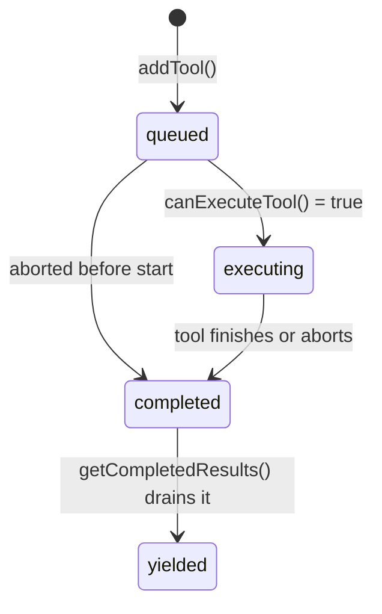
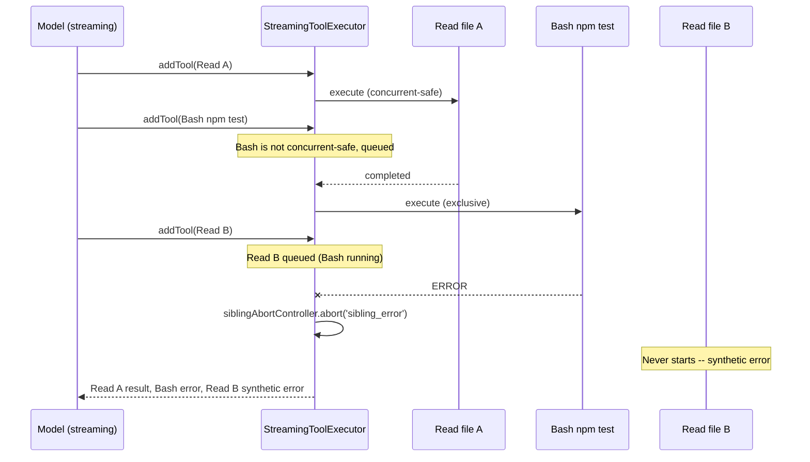

# The Streaming Tool Executor

In the standard tool execution model described in the previous chapters, tools wait until the API response is complete before any execution begins. The model finishes generating all its tool_use blocks, then the harness runs them. But here is the thing: tool_use blocks appear in the stream *as they are generated*. The model might emit a Read tool call, then spend another 5 seconds generating a Bash tool call. During those 5 seconds, the Read could already be running.

This is the insight behind the `StreamingToolExecutor` in `src/services/tools/StreamingToolExecutor.ts` -- a component that starts executing tools *while the model is still generating its response*.

## The State Machine

Each tool tracked by the `StreamingToolExecutor` moves through four states:



The states are defined as a string union:

```typescript
// src/services/tools/StreamingToolExecutor.ts (lines 19-33)
type ToolStatus = 'queued' | 'executing' | 'completed' | 'yielded'

type TrackedTool = {
  id: string
  block: ToolUseBlock
  assistantMessage: AssistantMessage
  status: ToolStatus
  isConcurrencySafe: boolean
  promise?: Promise<void>
  results?: Message[]
  pendingProgress: Message[]
  contextModifiers?: Array<(context: ToolUseContext) => ToolUseContext>
}
```

## Integration with the Query Loop

The streaming executor plugs into the main query loop in `src/query.ts`. As the API streams content blocks, the loop feeds them to the executor:

```typescript
// src/query.ts (lines 837-862)
// As tool_use blocks arrive during streaming:
if (streamingToolExecutor && !toolUseContext.abortController.signal.aborted) {
  for (const toolBlock of msgToolUseBlocks) {
    streamingToolExecutor.addTool(toolBlock, message)
  }
}

// Poll for completed results during streaming:
if (streamingToolExecutor && !toolUseContext.abortController.signal.aborted) {
  for (const result of streamingToolExecutor.getCompletedResults()) {
    if (result.message) {
      yield result.message
      // ... normalize and track results
    }
  }
}
```

This creates a pipeline where tool blocks enter the executor as they stream in, and completed results are drained each time the loop iterates. The model is still generating text while earlier tools are already running and returning results.

## Concurrency Rules

The `canExecuteTool` method determines whether a queued tool can start executing:

```typescript
// src/services/tools/StreamingToolExecutor.ts (lines 129-135)
private canExecuteTool(isConcurrencySafe: boolean): boolean {
  const executingTools = this.tools.filter(t => t.status === 'executing')
  return (
    executingTools.length === 0 ||
    (isConcurrencySafe && executingTools.every(t => t.isConcurrencySafe))
  )
}
```

The rule is clean: a tool can start if either (a) nothing else is running, or (b) both the new tool and all currently-running tools are concurrency-safe. This is the same principle as the batch-based orchestrator, but applied tool-by-tool as they arrive.

The `processQueue` method walks the tool list in order, starting anything that can run:

```typescript
// src/services/tools/StreamingToolExecutor.ts (lines 140-151)
private async processQueue(): Promise<void> {
  for (const tool of this.tools) {
    if (tool.status !== 'queued') continue

    if (this.canExecuteTool(tool.isConcurrencySafe)) {
      await this.executeTool(tool)
    } else {
      // Can't execute yet; non-concurrent tools block the queue
      if (!tool.isConcurrencySafe) break
    }
  }
}
```

Notice the `break` for non-concurrent tools: if a queued tool is not concurrency-safe and cannot run yet, nothing after it can start either. This preserves ordering guarantees -- the model's intended sequence of side effects is respected.

## Result Ordering

Results are yielded in **arrival order**, not completion order. The `getCompletedResults` generator walks the tool list front-to-back:

```typescript
// src/services/tools/StreamingToolExecutor.ts (lines 412-440)
*getCompletedResults(): Generator<MessageUpdate, void> {
  for (const tool of this.tools) {
    // Always yield pending progress messages immediately
    while (tool.pendingProgress.length > 0) {
      const progressMessage = tool.pendingProgress.shift()!
      yield { message: progressMessage, newContext: this.toolUseContext }
    }

    if (tool.status === 'yielded') continue

    if (tool.status === 'completed' && tool.results) {
      tool.status = 'yielded'
      for (const message of tool.results) {
        yield { message, newContext: this.toolUseContext }
      }
      markToolUseAsComplete(this.toolUseContext, tool.id)
    } else if (tool.status === 'executing' && !tool.isConcurrencySafe) {
      break  // Non-concurrent tool blocks yielding of subsequent tools
    }
  }
}
```

This ordering rule is subtle but important. If tool 3 is a non-concurrent Bash command and tools 4 and 5 are file reads, tool 5 might complete before tool 3. But we cannot yield tool 5's result yet -- it must wait for tool 3 to complete and yield first, because the model expects results in the order it requested them. Progress messages, however, are always yielded immediately regardless of ordering.

## The Sibling Abort Pattern

One of the most interesting patterns in the streaming executor is sibling abort. When a Bash tool fails, it should cancel other tools running in parallel -- they are likely part of the same logical operation and will fail or produce meaningless results anyway.

The executor creates a child abort controller for this purpose:

```typescript
// src/services/tools/StreamingToolExecutor.ts (lines 58-62)
constructor(toolDefinitions: Tools, canUseTool: CanUseToolFn, toolUseContext: ToolUseContext) {
  this.toolUseContext = toolUseContext
  this.siblingAbortController = createChildAbortController(
    toolUseContext.abortController,
  )
}
```

The key architectural insight is in the hierarchy. `siblingAbortController` is a **child** of the main `toolUseContext.abortController`. This means:

- If the parent aborts (e.g., user cancels the query), siblings are automatically aborted
- If a sibling aborts, the parent is **not** affected -- the query loop continues

When a Bash tool errors, the executor fires the sibling abort:

```typescript
// src/services/tools/StreamingToolExecutor.ts (lines 357-363)
if (isErrorResult) {
  thisToolErrored = true
  if (tool.block.name === BASH_TOOL_NAME) {
    this.hasErrored = true
    this.erroredToolDescription = this.getToolDescription(tool)
    this.siblingAbortController.abort('sibling_error')
  }
}
```

Only Bash errors trigger sibling abort. Read tools, web fetches, and other tools fail independently -- one grep returning no results should not kill a parallel file read. Bash commands are different because they often form implicit dependency chains (`mkdir` then `cd` then `npm install`), where one failure makes the rest pointless.



## Handling Remaining Results

After streaming ends (or on abort), `getRemainingResults` collects everything still pending:

```typescript
// src/services/tools/StreamingToolExecutor.ts (lines 453-490)
async *getRemainingResults(): AsyncGenerator<MessageUpdate, void> {
  while (this.hasUnfinishedTools()) {
    await this.processQueue()
    for (const result of this.getCompletedResults()) {
      yield result
    }
    // Wait for any executing tool to complete or progress to arrive
    if (this.hasExecutingTools() && !this.hasCompletedResults()) {
      const executingPromises = this.tools
        .filter(t => t.status === 'executing' && t.promise)
        .map(t => t.promise!)
      const progressPromise = new Promise<void>(resolve => {
        this.progressAvailableResolve = resolve
      })
      if (executingPromises.length > 0) {
        await Promise.race([...executingPromises, progressPromise])
      }
    }
  }
}
```

This method is called after the API stream finishes. It waits for all in-flight tools, draining results as they complete. The `Promise.race` against a progress promise ensures that progress messages are yielded quickly even while waiting for long-running tools to finish.

For tools that were queued but never started (because the executor was discarded due to a streaming fallback), synthetic error messages are generated so the model sees a result for every tool_use block it emitted:

```typescript
// src/services/tools/StreamingToolExecutor.ts (lines 153-205)
private createSyntheticErrorMessage(
  toolUseId: string,
  reason: 'sibling_error' | 'user_interrupted' | 'streaming_fallback',
  assistantMessage: AssistantMessage,
): Message {
  if (reason === 'user_interrupted') {
    return createUserMessage({ /* ... REJECT_MESSAGE ... */ })
  }
  if (reason === 'streaming_fallback') {
    return createUserMessage({ /* ... streaming fallback error ... */ })
  }
  // sibling_error
  const desc = this.erroredToolDescription
  const msg = desc
    ? `Cancelled: parallel tool call ${desc} errored`
    : 'Cancelled: parallel tool call errored'
  return createUserMessage({ /* ... */ })
}
```

## The Discard Mechanism

When a streaming fallback occurs (the API response needs to be retried), the executor's `discard()` method is called:

```typescript
// src/services/tools/StreamingToolExecutor.ts (lines 69-71)
discard(): void {
  this.discarded = true
}
```

This flag prevents queued tools from starting and causes `getCompletedResults` and `getRemainingResults` to return immediately. A fresh executor is created for the retry attempt. This is a clean separation: the old executor's in-flight work is abandoned, and no partial results leak into the retry.

## Key Takeaways

- **The streaming executor overlaps model generation with tool execution**, starting tools as their `tool_use` blocks arrive rather than waiting for the full response. This can significantly reduce end-to-end latency.
- **The state machine (queued, executing, completed, yielded)** tracks each tool through its lifecycle, with concurrency rules determining when queued tools can start.
- **Results are yielded in arrival order**, not completion order. Non-concurrent tools block the yield of subsequent tools to preserve the model's intended execution sequence.
- **The sibling abort pattern** uses a child abort controller so that a Bash failure can kill parallel siblings without aborting the parent query. Only Bash errors cascade -- other tool failures are independent.
- **Progress messages bypass ordering constraints** and are yielded immediately, keeping the UI responsive even when result ordering is blocked.
- **The discard mechanism** cleanly abandons an executor's work on streaming fallback, preventing partial results from contaminating retry attempts.
