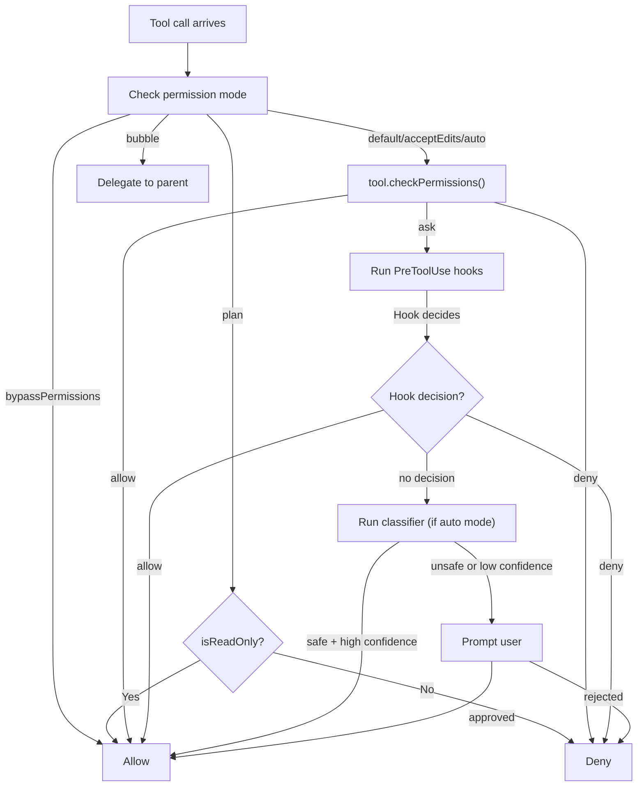

# The Permission System

Not every tool call should execute without question. Reading a file is harmless; `rm -rf /` is catastrophic. The permission system is the layer that decides, for each tool invocation, whether to allow it silently, deny it, or ask the user. In a production agent, getting this right is not optional -- it is the primary defense against the model doing something irreversible.

## Permission Modes

Claude Code defines six permission modes that set the baseline behavior for the entire session. These are defined in `src/types/permissions.ts`:

```typescript
// src/types/permissions.ts (lines 15-28)
export const EXTERNAL_PERMISSION_MODES = [
  'acceptEdits',
  'bypassPermissions',
  'default',
  'dontAsk',
  'plan',
] as const

export type InternalPermissionMode = ExternalPermissionMode | 'auto' | 'bubble'
export type PermissionMode = InternalPermissionMode
```

Here is what each mode does:

| Mode | Behavior |
|-|-|
| **default** | Ask the user before running dangerous tools. Read-only tools run freely. |
| **acceptEdits** | Allow file edits without asking. Still ask for bash commands and other potentially dangerous operations. |
| **bypassPermissions** | Allow everything. No permission prompts at all. Used for trusted automation environments. |
| **plan** | Read-only mode. Only allow tools that are marked `isReadOnly`. Deny everything else. |
| **dontAsk** | Never prompt the user. If a tool would normally require a prompt, deny it instead. |
| **auto** | A classifier examines each tool call and decides whether it looks safe. Safe calls proceed; risky ones are denied or escalated. |
| **bubble** | Used by subagents. Instead of making permission decisions locally, delegate them up to the parent agent's terminal. |

The `auto` mode is particularly interesting: rather than a static rule, it uses a language model as a classifier to evaluate bash commands against a set of allowed patterns. We will return to this shortly.

## The Decision Flow

When a tool call needs a permission decision, it flows through multiple layers. The full path is implemented across `src/utils/permissions/permissions.ts` and `src/hooks/useCanUseTool.tsx`:



### Step 1: Mode Check

The permission mode gates the entire flow. In `bypassPermissions` mode, everything is allowed. In `plan` mode, only read-only tools pass. Other modes fall through to the tool-specific check.

### Step 2: Tool-Specific Check

Each tool's `checkPermissions` method runs first. This is where tool-specific logic lives. For example, the GrepTool checks read permissions against file paths:

```typescript
// src/tools/GrepTool/GrepTool.ts (lines 233-240)
async checkPermissions(input, context): Promise<PermissionDecision> {
  const appState = context.getAppState()
  return checkReadPermissionForTool(
    GrepTool,
    input,
    appState.toolPermissionContext,
  )
}
```

The result is one of three behaviors: `allow` (proceed), `deny` (block), or `ask` (needs further decision).

### Step 3: Hook Override

PreToolUse hooks can override the permission decision. This is how organizations inject custom policies:

```typescript
// src/services/tools/toolExecution.ts (lines 831-832)
case 'hookPermissionResult':
  hookPermissionResult = result.hookPermissionResult
```

A hook might, for example, always deny `rm` commands in production directories, or always allow `git status` regardless of mode. The hook's decision, if provided, takes precedence over the default permission flow.

### Step 4: The Classifier

In `auto` mode, when the tool-specific check returns `ask`, a classifier evaluates the command. For bash commands, this is sometimes called the "YOLO classifier" -- it pattern-matches against known-safe command patterns with high confidence:

```typescript
// src/hooks/useCanUseTool.tsx (lines 126-157)
if (result.pendingClassifierCheck && tool.name === BASH_TOOL_NAME) {
  const speculativePromise =
    peekSpeculativeClassifierCheck((input as { command: string }).command)
  if (speculativePromise) {
    const raceResult = await Promise.race([
      speculativePromise.then(r => ({ type: 'result', result: r })),
      new Promise(res => setTimeout(res, 2000, { type: 'timeout' })),
    ])
    if (raceResult.type === 'result'
        && raceResult.result.matches
        && raceResult.result.confidence === 'high') {
      // Auto-allow: classifier is confident this is safe
      resolve(ctx.buildAllow(result.updatedInput ?? input, {
        decisionReason: {
          type: 'classifier',
          classifier: 'bash_allow',
          reason: `Allowed by prompt rule: "${raceResult.result.matchedDescription}"`,
        },
      }))
      return
    }
  }
}
```

The classifier runs speculatively -- it starts early (during the PreToolUse hook phase) and races against a 2-second timeout. If it returns a high-confidence match, the tool is auto-allowed without prompting the user. If it times out or returns low confidence, the flow falls through to an interactive prompt.

### Step 5: User Prompt

If all automated checks return `ask`, the user sees a permission prompt. They can approve (once or always), deny, or modify the input. Their decision feeds back into the permission context for future tool calls in the same session.

## Permission Rules

Beyond the mode and classifier, the system supports explicit rules stored in `.claude/settings.json`. These are organized by source:

```typescript
// src/Tool.ts (lines 123-138)
export type ToolPermissionContext = DeepImmutable<{
  mode: PermissionMode
  alwaysAllowRules: ToolPermissionRulesBySource
  alwaysDenyRules: ToolPermissionRulesBySource
  alwaysAskRules: ToolPermissionRulesBySource
  // ...
}>
```

Rules are keyed by source (`session`, `localSettings`, `userSettings`, `cliArg`) and can match tool names, tool name + input patterns (like `Bash(git *)` to allow all git commands), or specific file paths. Session rules are temporary; settings rules persist across sessions.

## Permission Scoping Across Subagents

When a subagent spawns, it gets its own permission scope. This is a deliberate security boundary. The logic in `src/tools/AgentTool/runAgent.ts` shows how parent permissions are scoped for the child:

```typescript
// src/tools/AgentTool/runAgent.ts (lines 465-479)
if (allowedTools !== undefined) {
  toolPermissionContext = {
    ...toolPermissionContext,
    alwaysAllowRules: {
      // Preserve SDK-level permissions from --allowedTools
      cliArg: state.toolPermissionContext.alwaysAllowRules.cliArg,
      // Use the provided allowedTools as session-level permissions
      session: [...allowedTools],
    },
  }
}
```

The subagent inherits CLI-level permissions (those from `--allowedTools`, which represent the SDK consumer's explicit intent) but **not** session-level permissions that the user granted interactively to the parent. The session rules are replaced with the subagent's own `allowedTools` list.

:::danger
Leaking parent permissions to subagents is a security hole. If a user approves `rm` for the parent, a subagent should not inherit that. Each subagent starts with a clean session-level permission slate, preserving only the explicit SDK-level grants.
:::

Additionally, async subagents that cannot show a UI have their prompts auto-denied:

```typescript
// src/tools/AgentTool/runAgent.ts (lines 440-451)
const shouldAvoidPrompts =
  canShowPermissionPrompts !== undefined
    ? !canShowPermissionPrompts
    : agentPermissionMode === 'bubble'
      ? false
      : isAsync
if (shouldAvoidPrompts) {
  toolPermissionContext = {
    ...toolPermissionContext,
    shouldAvoidPermissionPrompts: true,
  }
}
```

A background agent with no terminal access cannot prompt the user, so any `ask` decision becomes an automatic denial. The `bubble` mode is the exception -- it delegates the prompt to the parent's terminal, so the user can still approve.

## The Permission Pipeline in Practice

To make this concrete, consider a user running Claude Code in `default` mode. The model calls `Bash` with the command `git diff HEAD~1`:

1. **Mode check**: `default` mode -- proceed to tool-specific check
2. **tool.checkPermissions()**: Bash tool returns `ask` (it's a shell command)
3. **PreToolUse hooks**: No hooks configured -- no override
4. **Classifier**: Pattern-matches `git diff` against the allow-list. High confidence match against "git read-only commands"
5. **Result**: Auto-allowed. User never sees a prompt.

Now the model calls `Bash` with `curl https://example.com | bash`:

1. **Mode check**: `default` mode -- proceed
2. **tool.checkPermissions()**: Returns `ask`
3. **PreToolUse hooks**: No override
4. **Classifier**: No match (piping curl to bash is not in any allow-list)
5. **User prompt**: "Allow Bash: curl https://example.com | bash?"
6. **User**: Denies
7. **Result**: Tool call rejected. Model receives error message.

## Key Takeaways

- **Six permission modes** provide the baseline: `default` (ask for dangerous), `acceptEdits` (auto-approve edits), `bypassPermissions` (allow all), `plan` (read-only), `auto` (classifier decides), and `bubble` (delegate to parent).
- **The decision flow is layered**: mode check, tool-specific check, hook override, classifier, and finally user prompt. Each layer can short-circuit the flow.
- **The classifier runs speculatively** in parallel with other checks, racing against a timeout. This keeps the auto-allow path fast without blocking on slow classification.
- **Permission rules** can be scoped by source (session, local settings, user settings, CLI args) and match on tool name, input patterns, or file paths.
- **Subagents get isolated permission scopes.** Session-level grants from the parent do not leak through. Only explicit SDK-level permissions (`cliArg`) are preserved. Background agents without terminal access auto-deny any prompts.
- **The `bubble` mode** lets subagents delegate permission prompts to the parent's terminal, bridging the gap between full isolation and full inheritance.
