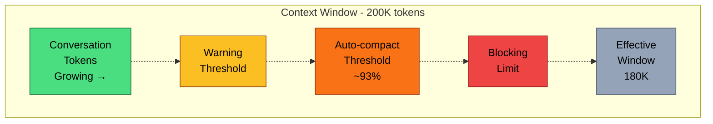

# The Context Window Problem

Every message in a conversation accumulates. The user's prompt, the system prompt, each assistant response, every tool call, every tool result -- they all stack up in a single linear array that gets sent to the API on every turn. And the context window is fixed.

This might sound like a minor bookkeeping problem, but in practice it is the central engineering challenge of a production agent harness. A typical coding session might involve reading dozens of files, running shell commands, editing code, and iterating on errors. Each of those tool calls produces a tool result. Some results -- like a `grep` across a large codebase -- can be tens of thousands of tokens on their own. A session that feels like a casual 20-minute conversation can quietly consume hundreds of thousands of tokens.

What happens when you approach the limit?

## The Effective Window

The first subtlety: you don't get the full context window. The model needs room to *respond*, so the harness must reserve tokens for output. Here's the actual calculation from `autoCompact.ts`:

```typescript
// src/services/compact/autoCompact.ts, lines 29-49

// Reserve this many tokens for output during compaction
// Based on p99.99 of compact summary output being 17,387 tokens.
const MAX_OUTPUT_TOKENS_FOR_SUMMARY = 20_000

// Returns the context window size minus the max output tokens for the model
export function getEffectiveContextWindowSize(model: string): number {
  const reservedTokensForSummary = Math.min(
    getMaxOutputTokensForModel(model),
    MAX_OUTPUT_TOKENS_FOR_SUMMARY,
  )
  let contextWindow = getContextWindowForModel(model, getSdkBetas())

  const autoCompactWindow = process.env.CLAUDE_CODE_AUTO_COMPACT_WINDOW
  if (autoCompactWindow) {
    const parsed = parseInt(autoCompactWindow, 10)
    if (!isNaN(parsed) && parsed > 0) {
      contextWindow = Math.min(contextWindow, parsed)
    }
  }

  return contextWindow - reservedTokensForSummary
}
```

For a model with a 200K context window and 20K reserved for output, the effective window is 180K tokens. That's what the harness has to work with for the *entire* conversation history -- system prompt, messages, and all.

## The Structural Coupling Problem

You might think: "If we're running low on space, just drop some old messages." But you can't arbitrarily remove messages from the conversation. The Anthropic API enforces a structural invariant: **every `tool_use` block in an assistant message must have a matching `tool_result` block in a subsequent user message**, and vice versa.

If you drop a message containing a `tool_use` but keep its `tool_result`, the API returns a validation error. If you keep the `tool_use` but drop the `tool_result`, same error. Messages are structurally coupled -- they form pairs that must be preserved or removed together.

This means "just trim old messages" requires understanding the dependency graph of tool use/result pairs. It's not a simple queue where you pop from the front.

## The Threshold Hierarchy

Claude Code doesn't wait until the context window is full to act. It defines a hierarchy of thresholds, each triggering progressively more aggressive interventions:

```typescript
// src/services/compact/autoCompact.ts, lines 62-70

export const AUTOCOMPACT_BUFFER_TOKENS = 13_000
export const WARNING_THRESHOLD_BUFFER_TOKENS = 20_000
export const ERROR_THRESHOLD_BUFFER_TOKENS = 20_000
export const MANUAL_COMPACT_BUFFER_TOKENS = 3_000

// Stop trying autocompact after this many consecutive failures.
const MAX_CONSECUTIVE_AUTOCOMPACT_FAILURES = 3
```

These buffer values are subtracted from the effective window (or the auto-compact threshold) to determine when each level triggers. The `calculateTokenWarningState()` function evaluates all of them at once:

```typescript
// src/services/compact/autoCompact.ts, lines 93-145

export function calculateTokenWarningState(
  tokenUsage: number,
  model: string,
): {
  percentLeft: number
  isAboveWarningThreshold: boolean
  isAboveErrorThreshold: boolean
  isAboveAutoCompactThreshold: boolean
  isAtBlockingLimit: boolean
} {
  const autoCompactThreshold = getAutoCompactThreshold(model)
  const threshold = isAutoCompactEnabled()
    ? autoCompactThreshold
    : getEffectiveContextWindowSize(model)

  // ... threshold calculations ...

  const isAboveAutoCompactThreshold =
    isAutoCompactEnabled() && tokenUsage >= autoCompactThreshold

  const actualContextWindow = getEffectiveContextWindowSize(model)
  const defaultBlockingLimit =
    actualContextWindow - MANUAL_COMPACT_BUFFER_TOKENS

  const isAtBlockingLimit = tokenUsage >= blockingLimit

  return {
    percentLeft,
    isAboveWarningThreshold,
    isAboveErrorThreshold,
    isAboveAutoCompactThreshold,
    isAtBlockingLimit,
  }
}
```

Here is how these thresholds relate to each other over the course of a session:



As a conversation progresses:

1. **Warning threshold** (effective window - 20K buffer): The UI shows the user a context usage warning. No automatic action yet -- just awareness.
2. **Auto-compact threshold** (~93% of effective window): The system automatically triggers compaction -- summarizing the conversation to free space. This is the primary defense.
3. **Blocking limit** (effective window - 3K buffer): If auto-compact is disabled or has failed, the system blocks further input. The user must manually run `/compact` before continuing.
4. **Beyond the effective window**: The API itself rejects the request with an HTTP 413 "prompt too long" error.

:::info
The context window includes *everything*: system prompt, user messages, assistant messages, tool calls, and tool results. A single large file read can consume 50,000+ tokens. A tool-heavy turn with five file reads and a few grep results can easily add 100K+ tokens to the conversation in a single exchange.
:::

## Why This Is Hard

The fundamental tension is between **memory** and **capacity**. The model needs to remember what it has done -- which files it read, what changes it made, what errors it encountered -- to make coherent decisions. But every piece of remembered context eats into the fixed budget.

This isn't a problem you can solve with a single strategy. Different situations call for different tradeoffs: sometimes you can afford to compress old tool results without losing much; sometimes you need to summarize entire conversation segments; sometimes the API rejects your request and you need to recover in real time.

Claude Code addresses this with not one but five distinct layers of defense, applied in a careful order from cheapest to most expensive. We'll walk through each one next.

## Key Takeaways

- **The effective context window is smaller than the model's advertised limit** -- output tokens must be reserved, reducing usable space by up to 20K tokens.
- **Messages are structurally coupled**: every `tool_use` must have a matching `tool_result`. You cannot arbitrarily drop individual messages without breaking the API contract.
- **A hierarchy of thresholds** (warning, auto-compact, blocking, API rejection) triggers progressively more aggressive interventions as the conversation grows.
- **Context management is the central engineering challenge** of a production agent harness -- not an afterthought, but the system that determines whether long sessions succeed or fail.
