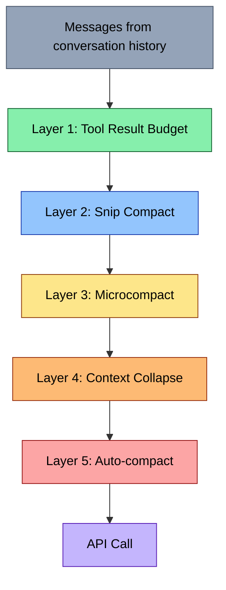

# Five Layers of Defense

Claude Code doesn't have one compaction strategy. It has five, applied in a deliberate order from cheapest to most expensive. Each layer targets a different kind of waste, and each runs before the next so that if a cheaper intervention frees enough space, the more expensive ones never fire.

This ordering is not incidental -- it's load-bearing architecture. Let's trace through the pipeline as it appears in the query loop.

## The Pipeline

Every iteration of the main query loop (in `query.ts`) runs the five layers in sequence before making an API call. Here's the order, visible from lines 370-468:



Each layer takes the message array as input and returns a (possibly shorter) message array as output. They compose cleanly because each operates on the result of the previous step.

## Layer 1: Tool Result Budget

**Cost:** Disk I/O for large results. No API call.

The cheapest intervention doesn't summarize or remove anything -- it moves oversized tool results to disk and replaces them with compact references. This happens inline, before any other compaction step.

The entry point is `applyToolResultBudget()` in `src/utils/toolResultStorage.ts`, called at line 379 of `query.ts`:

```typescript
// src/query.ts, lines 379-394
messagesForQuery = await applyToolResultBudget(
  messagesForQuery,
  toolUseContext.contentReplacementState,
  persistReplacements
    ? records =>
        void recordContentReplacement(
          records,
          toolUseContext.agentId,
        ).catch(logError)
    : undefined,
  new Set(
    toolUseContext.options.tools
      .filter(t => !Number.isFinite(t.maxResultSizeChars))
      .map(t => t.name),
  ),
)
```

The function delegates to `enforceToolResultBudget()`, which walks each message group and checks whether the aggregate size of tool results exceeds a per-message budget. When a message is over budget, the largest tool results are persisted to disk files (under `<session-dir>/tool-results/<tool_use_id>.txt`) and replaced with a short preview:

```typescript
// src/utils/toolResultStorage.ts, lines 769-909 (simplified flow)
export async function enforceToolResultBudget(
  messages: Message[],
  state: ContentReplacementState,
  skipToolNames: ReadonlySet<string> = new Set(),
): Promise<{
  messages: Message[]
  newlyReplaced: ToolResultReplacementRecord[]
}> {
  const candidatesByMessage = collectCandidatesByMessage(messages)
  // ...
  for (const candidates of candidatesByMessage) {
    const { mustReapply, frozen, fresh } = partitionByPriorDecision(
      candidates, state,
    )

    // Re-apply: pure Map lookups. No file I/O, byte-identical, cannot fail.
    mustReapply.forEach(c => replacementMap.set(c.toolUseId, c.replacement))

    // Fresh: check per-message budget, select largest for replacement
    if (frozenSize + freshSize > limit) {
      selected = selectFreshToReplace(eligible, frozenSize, limit)
    }
  }
  // Persist selected results to disk, replace in messages
  return { messages: replaceToolResultContents(messages, replacementMap), newlyReplaced }
}
```

A subtle but important detail: decisions are **frozen** after first evaluation. The `ContentReplacementState` tracks every tool_use_id it has seen. Once a result has been sent to the model (replaced or not), that decision is locked for the rest of the session. This preserves prompt cache stability -- if the same message is sent with different content on different turns, it invalidates the cache prefix.

## Layer 2: Snip Compact

**Cost:** Message removal with token estimation. No API call.

Snip compact surgically removes the oldest messages from the conversation while preserving a "protected tail" of recent ones. Unlike full compaction (which summarizes everything), snip just *drops* old messages -- the information is lost, not condensed.

The key insight is that very old tool results (a file read from 50 turns ago) are rarely relevant to the current task. Snip exploits this by removing from the middle of the conversation, keeping both the beginning (system context, initial instructions) and the end (recent work):

```typescript
// src/query.ts, lines 396-410
// Apply snip before microcompact (both may run — they are not mutually exclusive).
let snipTokensFreed = 0
if (feature('HISTORY_SNIP')) {
  queryCheckpoint('query_snip_start')
  const snipResult = snipModule!.snipCompactIfNeeded(messagesForQuery)
  messagesForQuery = snipResult.messages
  snipTokensFreed = snipResult.tokensFreed
  if (snipResult.boundaryMessage) {
    yield snipResult.boundaryMessage
  }
  queryCheckpoint('query_snip_end')
}
```

The `snipTokensFreed` value is threaded through to auto-compact (layer 5), because `tokenCountWithEstimation` on the surviving messages can't see the savings -- the protected-tail assistant's token usage still reflects the pre-snip context.

## Layer 3: Microcompact

**Cost:** Depends on variant. Time-based: no API call. Cached: uses cache editing API.

Microcompact targets individual tool results rather than entire messages. It has two distinct modes, selected based on context:

**Time-based microcompact** fires when enough time has passed since the last assistant message that the server's prompt cache has gone cold. Since the prefix will be rewritten anyway, this is a free opportunity to clear old tool results:

```typescript
// src/services/compact/microCompact.ts, lines 253-293 (simplified)
export async function microcompactMessages(
  messages: Message[],
  toolUseContext?: ToolUseContext,
  querySource?: QuerySource,
): Promise<MicrocompactResult> {
  // Time-based trigger runs first and short-circuits. If the gap since the
  // last assistant message exceeds the threshold, the server cache has expired
  // and the full prefix will be rewritten regardless — so content-clear old
  // tool results now, before the request, to shrink what gets rewritten.
  const timeBasedResult = maybeTimeBasedMicrocompact(messages, querySource)
  if (timeBasedResult) {
    return timeBasedResult
  }

  // Cached microcompact: uses cache editing API to remove tool results
  // without invalidating the cached prefix.
  if (feature('CACHED_MICROCOMPACT')) {
    // ... cache-editing path
  }

  return { messages }
}
```

**Cached microcompact** is more sophisticated: it uses the API's `cache_edits` mechanism to delete specific tool results from the cached prefix without invalidating it. This is the ideal path when the cache is warm -- you save tokens without paying the re-caching cost.

The two modes are mutually exclusive per turn: if the cache is cold (time-based fires), there's no point in cache-editing.

## Layer 4: Context Collapse

**Cost:** Read-time projection over committed summaries. No API call for the projection itself.

Context collapse is a fundamentally different approach from the layers above. Instead of modifying the underlying message array, it creates a **read-time projection** that replaces ranges of messages with pre-computed summaries. The original messages remain in the REPL's history -- collapse just changes what the model *sees*.

```typescript
// src/query.ts, lines 428-447
// Project the collapsed context view and maybe commit more collapses.
// Runs BEFORE autocompact so that if collapse gets us under the
// autocompact threshold, autocompact is a no-op and we keep granular
// context instead of a single summary.
//
// Nothing is yielded — the collapsed view is a read-time projection
// over the REPL's full history. Summary messages live in the collapse
// store, not the REPL array.
if (feature('CONTEXT_COLLAPSE') && contextCollapse) {
  const collapseResult = await contextCollapse.applyCollapsesIfNeeded(
    messagesForQuery,
    toolUseContext,
    querySource,
  )
  messagesForQuery = collapseResult.messages
}
```

The comment in the source is worth reading carefully: "This is what makes collapses persist across turns: `projectView()` replays the commit log on every entry." The collapse system maintains a log of committed summaries. Each turn, it replays that log to produce the projected view. Within a turn, the view flows forward via the state's messages at the continue site.

The key advantage of collapse over full summarization is **granularity**. Collapse can summarize a *segment* of the conversation (say, turns 5-15) while preserving the rest verbatim. Auto-compact (layer 5) replaces *everything* with a single summary.

## Layer 5: Auto-compact

**Cost:** Full API call to summarize the conversation. The most expensive layer.

When all cheaper layers have run and the context still exceeds the auto-compact threshold (~93% of the effective window), the system triggers a full conversation summarization. This is the nuclear option -- it replaces the entire conversation history with a condensed summary.

```typescript
// src/services/compact/autoCompact.ts, lines 72-91
export function getAutoCompactThreshold(model: string): number {
  const effectiveContextWindow = getEffectiveContextWindowSize(model)

  const autocompactThreshold =
    effectiveContextWindow - AUTOCOMPACT_BUFFER_TOKENS

  // ...override handling...

  return autocompactThreshold
}
```

The auto-compact system includes a **circuit breaker** that stops retrying after repeated failures:

```typescript
// src/services/compact/autoCompact.ts, lines 67-70
// Stop trying autocompact after this many consecutive failures.
// BQ 2026-03-10: 1,279 sessions had 50+ consecutive failures (up to 3,272)
// in a single session, wasting ~250K API calls/day globally.
const MAX_CONSECUTIVE_AUTOCOMPACT_FAILURES = 3
```

That comment is illuminating. Before the circuit breaker, sessions where context was irrecoverably over the limit would hammer the API with doomed compaction attempts on every single turn -- thousands of wasted API calls per session, multiplied across all users. The fix is simple: track consecutive failures, and after 3, stop trying.

```typescript
// src/services/compact/autoCompact.ts, lines 257-265
// Circuit breaker: stop retrying after N consecutive failures.
if (
  tracking?.consecutiveFailures !== undefined &&
  tracking.consecutiveFailures >= MAX_CONSECUTIVE_AUTOCOMPACT_FAILURES
) {
  return { wasCompacted: false }
}
```

The counter resets to 0 on any successful compaction, so a transient failure doesn't permanently disable the system.

## Why the Order Matters

The ordering of these layers is architecturally significant. Consider what happens if you swap layers 4 and 5:

- **Context collapse before auto-compact (current order):** Collapse projects a smaller view. If this gets the context under the auto-compact threshold, auto-compact never fires. The model retains granular access to recent messages, with only older segments summarized.
- **Auto-compact before context collapse (hypothetical):** Auto-compact fires first, replacing the *entire* conversation with a summary. Collapse never gets a chance to preserve recent context at full fidelity.

The source code makes this explicit:

> "Runs BEFORE autocompact so that if collapse gets us under the autocompact threshold, autocompact is a no-op and we keep granular context instead of a single summary."

Similarly, the tool result budget (layer 1) runs before everything else because it's essentially free -- moving bytes to disk costs nothing compared to an API call. Snip (layer 2) runs before microcompact (layer 3) because removing entire messages is cheaper than selectively compressing individual tool results.

Each layer is a bet: "Can I free enough space with this cheap intervention so the expensive one doesn't need to fire?" The pipeline succeeds when the answer is yes at an early layer.

## Key Takeaways

- **Five layers, cheapest first:** tool result budget (disk I/O) → snip (message removal) → microcompact (result compression) → context collapse (read-time projection) → auto-compact (full summarization).
- **Each layer operates on the output of the previous one,** and they are not mutually exclusive -- multiple layers can fire in a single turn.
- **The order is load-bearing:** context collapse runs before auto-compact specifically so granular context is preserved when possible.
- **Auto-compact has a circuit breaker** (3 consecutive failures) to prevent runaway API waste in irrecoverable situations.
- **Tool result budget decisions are frozen** after first evaluation to preserve prompt cache stability across turns.
