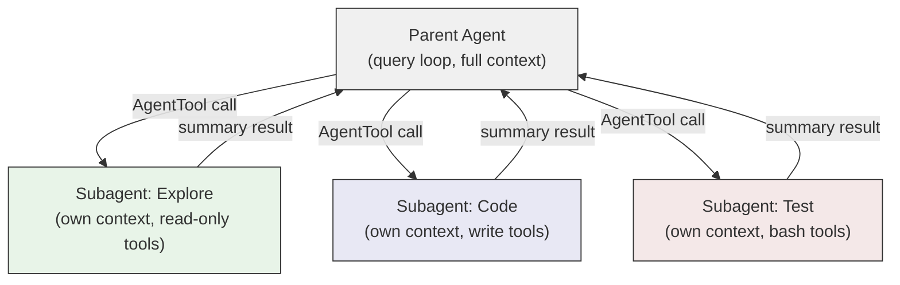

# Why Subagents

A single agent loop -- the `while(true)` we explored in Module 2 -- is remarkably capable. It can read files, write code, run tests, and iterate on feedback. But as tasks grow in scope, a single loop hits fundamental limits. Not limits of the model's intelligence, but limits of the architecture itself.

Consider a parent agent refactoring a large codebase. It needs to understand the existing architecture (reading dozens of files), plan the changes, execute them across multiple modules, and verify the results. Each sub-task generates intermediate context -- file contents, grep results, test outputs -- that consumes the context window. By the time the agent reaches the verification step, it may have forgotten the details of its own plan.

This is where subagents enter the picture.

## Three Motivations

### 1. Context Isolation

A parent agent working on a complex task can spawn a focused subagent for a sub-task. The subagent gets its own context window -- a fresh scratch space where it can do deep work without polluting the parent's context with intermediate detail. When it finishes, the parent gets back a concise summary. The ten files the subagent read, the three grep searches it ran, the dead ends it explored -- all of that stays contained.

This is not just a convenience. It's a structural solution to context window decay. Without isolation, a long-running agent's context fills with the detritus of earlier sub-tasks, making later work less effective. With subagents, the parent's context stays focused on the high-level plan while children handle the details.

### 2. Parallel Execution

Some tasks decompose naturally into independent pieces. "Update the API handler, the database schema, and the test suite" -- these three changes don't depend on each other. A single agent would handle them sequentially, each consuming a full round of API calls. Three subagents can work on them simultaneously.

The parent kicks off all three, continues its own work (or waits), and collects the results. The wall-clock time drops from the sum of all three tasks to the duration of the longest one.

### 3. Permission Scoping

Not every sub-task needs the same level of access. An "Explore" agent that's researching a codebase needs read access but shouldn't be writing files. Running it as a subagent with restricted tools is safer than running it as the main agent with full write access and hoping it exercises restraint.

Permission scoping turns a soft constraint ("the model should avoid writing files") into a hard one ("the model's tool set doesn't include file-writing tools"). This is a meaningful safety boundary in production systems.

## How Subagents Are Spawned

The entry point is the `AgentTool` -- a tool like any other in the agent's tool set, invoked by the model when it decides to delegate work. Its input schema defines what the model can specify:

```typescript
// src/tools/AgentTool/AgentTool.tsx, line 82
const baseInputSchema = lazySchema(() => z.object({
  description: z.string().describe('A short (3-5 word) description of the task'),
  prompt: z.string().describe('The task for the agent to perform'),
  subagent_type: z.string().optional().describe(
    'The type of specialized agent to use for this task'
  ),
  model: z.enum(['sonnet', 'opus', 'haiku']).optional().describe(
    "Optional model override for this agent."
  ),
  run_in_background: z.boolean().optional().describe(
    'Set to true to run this agent in the background.'
  )
}));
```

The model chooses the agent type (`Explore`, `Plan`, a custom agent, or none for a fork), optionally overrides the model, and decides whether to run in the background. The full schema also includes `isolation` (for worktree-based filesystem isolation) and `cwd` (for working directory overrides), but the base schema captures the essential decisions.

Notice that this is a *tool* -- the model invokes it the same way it invokes `Bash` or `Read`. The harness doesn't need special orchestration logic for subagents. The model decides when to delegate, and the tool system handles the rest. This keeps the architecture uniform: there's no separate "agent manager" or "task scheduler." Delegation is just another tool call.

The `subagent_type` field determines which agent definition to load. Each agent definition specifies its own system prompt, available tools, permission mode, and model preference. An `Explore` agent might be restricted to read-only tools and a cheaper model; a code-writing agent might get full write access and a more capable model. The `AgentTool.call()` function resolves the agent definition and assembles the appropriate tool pool for the child, independent of the parent's restrictions:

```typescript
// src/tools/AgentTool/AgentTool.tsx, line 573
const workerPermissionContext = {
  ...appState.toolPermissionContext,
  mode: selectedAgent.permissionMode ?? 'acceptEdits'
};
const workerTools = assembleToolPool(workerPermissionContext, appState.mcp.tools);
```

## A Subagent Is Just Another Query Loop

The implementation insight is that a subagent is not a separate system. It's another invocation of the same `query()` function we studied in Module 2 -- with its own messages, system prompt, and context. The `runAgent` generator function sets this up:

```typescript
// src/tools/AgentTool/runAgent.ts, line 248
export async function* runAgent({
  agentDefinition,
  promptMessages,
  toolUseContext,
  canUseTool,
  isAsync,
  canShowPermissionPrompts,
  forkContextMessages,
  querySource,
  override,
  model,
  maxTurns,
  availableTools,
  // ...
}: { ... }): AsyncGenerator<Message, void> {
```

Deep inside, `runAgent` calls `query()` -- the very same function the REPL uses:

```typescript
// src/tools/AgentTool/runAgent.ts, line 748
for await (const message of query({
  messages: initialMessages,
  systemPrompt: agentSystemPrompt,
  userContext: resolvedUserContext,
  systemContext: resolvedSystemContext,
  canUseTool,
  toolUseContext: agentToolUseContext,
  querySource,
  maxTurns: maxTurns ?? agentDefinition.maxTurns,
})) {
  // forward messages to parent...
}
```

This is the recursive elegance of the design. The same query loop that drives the top-level agent also drives every subagent. The difference is in the *context* passed to it: a different system prompt, a different set of available tools, a different permission mode, and its own message history.

## The Architecture at a Glance



Each subagent has its own context window and tool set. Results flow back to the parent as tool results -- the same mechanism used for any other tool. The parent sees a summary; the subagent's internal work is invisible to it.

## Key Takeaways

- **Subagents solve three problems**: context isolation (keep the parent's context clean), parallel execution (do independent work simultaneously), and permission scoping (enforce tool restrictions structurally).
- **A subagent is another `query()` invocation** -- the same loop, different context. This recursive design means the entire agent infrastructure (streaming, tool execution, error recovery) works identically at every level.
- **The `AgentTool` is the interface** -- the model invokes it like any other tool, specifying the task, agent type, and execution mode. The harness handles the rest.
- **Results flow back as tool results** -- the parent sees a summary, not the subagent's full conversation history. This is what makes context isolation work.
