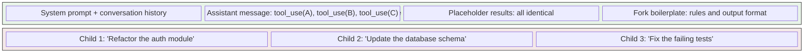

# Resource Lifecycle and Fork Optimization

Every subagent is a miniature system: it connects to MCP servers, registers hooks, tracks prompt cache state, maintains a file state cache, spawns bash processes, and writes transcripts. When it finishes -- whether by completing its task, hitting an error, or being aborted -- all of these resources must be released.

This sounds obvious, but in practice it's one of the hardest parts of an agent harness to get right. Agent systems are long-running. A power user might spawn hundreds of subagents in a single session. Each leaked resource is small. The accumulated effect is not.

## Part 1: Cleanup Discipline

The cleanup logic lives in the `finally` block of `runAgent`, which executes on normal completion, abort, or error:

```typescript
// src/tools/AgentTool/runAgent.ts, line 816
} finally {
  // Clean up agent-specific MCP servers
  await mcpCleanup()
  // Clean up agent's session hooks
  if (agentDefinition.hooks) {
    clearSessionHooks(rootSetAppState, agentId)
  }
  // Clean up prompt cache tracking state for this agent
  if (feature('PROMPT_CACHE_BREAK_DETECTION')) {
    cleanupAgentTracking(agentId)
  }
  // Release cloned file state cache memory
  agentToolUseContext.readFileState.clear()
  // Release the cloned fork context messages
  initialMessages.length = 0
  // Release perfetto agent registry entry
  unregisterPerfettoAgent(agentId)
  // Release transcript subdir mapping
  clearAgentTranscriptSubdir(agentId)
  // Release this agent's todos entry
  rootSetAppState(prev => {
    if (!(agentId in prev.todos)) return prev
    const { [agentId]: _removed, ...todos } = prev.todos
    return { ...prev, todos }
  })
  // Kill any background bash tasks this agent spawned
  killShellTasksForAgent(agentId, toolUseContext.getAppState, rootSetAppState)
  // Kill monitor MCP tasks
  if (feature('MONITOR_TOOL')) {
    const mcpMod = require('../../tasks/MonitorMcpTask/MonitorMcpTask.js')
    mcpMod.killMonitorMcpTasksForAgent(
      agentId,
      toolUseContext.getAppState,
      rootSetAppState,
    )
  }
}
```

Let's walk through each step and understand why it exists.

### 1. MCP Server Connections

```typescript
await mcpCleanup()
```

Agents can define their own MCP servers in their frontmatter. These are connected at startup (`initializeAgentMcpServers` at line 95) and must be disconnected on completion. Crucially, only *newly-created* connections are cleaned up -- servers referenced by name from the parent's configuration are shared and should not be disconnected when a child finishes. The cleanup function tracks this distinction via the `newlyCreatedClients` array.

### 2. Session Hooks

```typescript
if (agentDefinition.hooks) {
  clearSessionHooks(rootSetAppState, agentId)
}
```

Agent definitions can register hooks (e.g., `SubagentStop`, custom session hooks). These hooks are scoped to the agent's lifecycle via `agentId`. Without cleanup, hook handlers accumulate in the root app state across agent spawns.

### 3. Prompt Cache Tracking

```typescript
cleanupAgentTracking(agentId)
```

The prompt cache break detection system tracks per-agent state to detect when the API's prompt cache is invalidated. Each agent gets its own tracking entry; cleaning it up prevents unbounded growth of the tracking map.

### 4. File State Cache

```typescript
agentToolUseContext.readFileState.clear()
```

Each subagent gets a cloned file state cache (created via `cloneFileStateCache` in `createSubagentContext`). This cache maps file paths to their contents and metadata. `.clear()` releases all entries immediately rather than waiting for the enclosing closure to be garbage collected.

### 5. Fork Context Messages

```typescript
initialMessages.length = 0
```

This line deserves special attention. `initialMessages` holds the full forked conversation context -- every message from the parent's history that was passed to the child. For a long-running parent, this can be substantial.

Setting `length = 0` on an array is a deliberate garbage collection hint. It doesn't just mark the array as empty -- it releases the references to every `Message` object in the array. Without this, those references survive as long as the `runAgent` closure is reachable (which may be longer than you'd expect, due to callbacks, promise chains, and the async generator machinery). This pattern is worth internalizing: when you have a large array inside a long-lived closure, explicitly clearing it tells the GC that the data is no longer needed, rather than hoping the closure itself gets collected promptly.

### 6. Perfetto Tracing Registry

```typescript
unregisterPerfettoAgent(agentId)
```

The Perfetto tracing system maintains a registry of active agents for performance tracing. Each entry is small, but hundreds of orphaned entries add up.

### 7. Transcript Subdirectory Mapping

```typescript
clearAgentTranscriptSubdir(agentId)
```

Agents can have their transcripts grouped into subdirectories (e.g., for workflow runs). The mapping from `agentId` to subdirectory path must be released.

### 8. Orphaned Todo Entries

```typescript
rootSetAppState(prev => {
  if (!(agentId in prev.todos)) return prev
  const { [agentId]: _removed, ...todos } = prev.todos
  return { ...prev, todos }
})
```

If a subagent used `TodoWrite`, it left an entry in `AppState.todos` keyed by its `agentId`. Even after all items complete, the key persists with an empty array. Over hundreds of agents, these orphaned keys accumulate. The comment in the source is worth reading: "Whale sessions spawn hundreds of agents; each orphaned key is a small leak that adds up."

### 9. Background Bash Tasks

```typescript
killShellTasksForAgent(agentId, toolUseContext.getAppState, rootSetAppState)
```

A subagent might spawn background shell processes (e.g., a file watcher, a test runner with `run_in_background`). Without explicit cleanup, these processes outlive the agent as PPID=1 orphans -- zombie processes that persist until the main session exits.

### 10. Monitor MCP Tasks

```typescript
mcpMod.killMonitorMcpTasksForAgent(agentId, ...)
```

Similar to bash tasks, MCP monitor tasks must be killed when their owning agent terminates.

:::danger
In agent systems, resource leaks compound over long sessions. Each subagent that doesn't clean up leaves a small leak. Any single leak is harmless. But power users run sessions that span hours and spawn hundreds of subagents. At that scale, "small" leaks in memory, process handles, and state entries become serious. The `finally` block is not an afterthought -- it's load-bearing infrastructure.
:::

## Part 2: Fork Subagent (Prompt Cache Optimization)

The fork subagent is a specialized execution path designed around a specific optimization: *prompt cache sharing across sibling subagents*.

### The Cache Problem

Every API call sends the full conversation as the request body. The API provider can cache the prefix of this conversation -- if two consecutive requests share the same prefix bytes, the cached portion doesn't need reprocessing. This saves both latency and cost.

When a parent spawns multiple subagents, each child gets a different task. Naively, their API requests would diverge immediately (different system prompts, different initial messages), getting zero cache benefit. The fork subagent path is designed to maximize the shared prefix.

### How `buildForkedMessages` Works

The key function is `buildForkedMessages` in `forkSubagent.ts`. Its job: given the parent's assistant message (containing multiple `tool_use` blocks -- one per fork child) and a per-child directive, build a message sequence where everything except the final directive is byte-identical across all children.

```typescript
// src/tools/AgentTool/forkSubagent.ts, line 107
export function buildForkedMessages(
  directive: string,
  assistantMessage: AssistantMessage,
): MessageType[] {
  // Clone the assistant message (all tool_use blocks preserved)
  const fullAssistantMessage: AssistantMessage = {
    ...assistantMessage,
    uuid: randomUUID(),
    message: {
      ...assistantMessage.message,
      content: [...assistantMessage.message.content],
    },
  }

  // Collect all tool_use blocks
  const toolUseBlocks = assistantMessage.message.content.filter(
    (block): block is BetaToolUseBlock => block.type === 'tool_use',
  )

  // Build identical placeholder results for every tool_use
  const toolResultBlocks = toolUseBlocks.map(block => ({
    type: 'tool_result' as const,
    tool_use_id: block.id,
    content: [{
      type: 'text' as const,
      text: FORK_PLACEHOLDER_RESULT,  // "Fork started — processing in background"
    }],
  }))

  // Single user message: all placeholders + per-child directive
  const toolResultMessage = createUserMessage({
    content: [
      ...toolResultBlocks,
      { type: 'text' as const, text: buildChildMessage(directive) },
    ],
  })

  return [fullAssistantMessage, toolResultMessage]
}
```

The trick: every child gets the *full* assistant message (all `tool_use` blocks, not just its own) and *identical* placeholder `tool_result` blocks for every tool use. Only the final text block -- the per-child directive -- differs.

### A Concrete Example

Suppose the parent spawns 3 forks. The parent's assistant message contains three `tool_use` blocks: `tool_A`, `tool_B`, `tool_C`. Each fork child's API request looks like:

```
[...shared conversation history...]
assistant: [thinking, tool_use(A), tool_use(B), tool_use(C)]
user: [
  tool_result(A): "Fork started — processing in background",
  tool_result(B): "Fork started — processing in background",
  tool_result(C): "Fork started — processing in background",
  text: "<fork-boilerplate>...rules...</fork-boilerplate>\n<fork-directive>YOUR SPECIFIC TASK"
]
```

Everything before `YOUR SPECIFIC TASK` is byte-identical across all three children. The API caches this shared prefix on the first child's request. The second and third children get a cache hit on the entire prefix -- only the divergent tail (the directive text) needs fresh processing.



The fork path also inherits the parent's exact tool definitions and thinking configuration (via the `useExactTools` flag) to ensure byte-identical tool definition serialization in the API request. Even small differences -- a different permission mode changing which tools are included -- would break the cache at the first divergent byte.

### The Recursive Fork Guard

Fork children keep the `Agent` tool in their tool pool (for cache-identical tool definitions), but they must not actually fork again. The guard checks two things:

```typescript
// src/tools/AgentTool/forkSubagent.ts, line 78
export function isInForkChild(messages: MessageType[]): boolean {
  return messages.some(m => {
    if (m.type !== 'user') return false
    const content = m.message.content
    if (!Array.isArray(content)) return false
    return content.some(
      block =>
        block.type === 'text' &&
        block.text.includes(`<${FORK_BOILERPLATE_TAG}>`),
    )
  })
}
```

The primary check is `querySource` (set on `context.options` at spawn time, which survives autocompaction). The message-scan fallback catches any path where `querySource` wasn't threaded. Two layers of defense, because autocompaction can rewrite messages but not context options, and some code paths might not thread `querySource` correctly.

The fork child's boilerplate message makes the constraint explicit: "You are a forked worker process. You are NOT the main agent. Do NOT spawn sub-agents; execute directly."

### The System Prompt Strategy

A subtle but important detail: fork children inherit the parent's rendered system prompt bytes, not a freshly-computed system prompt:

```typescript
// src/tools/AgentTool/forkSubagent.ts, line 53 (comment)
// The getSystemPrompt here is unused: the fork path passes
// override.systemPrompt with the parent's already-rendered system prompt
// bytes, threaded via toolUseContext.renderedSystemPrompt. Reconstructing
// by re-calling getSystemPrompt() can diverge (GrowthBook cold→warm) and
// bust the prompt cache; threading the rendered bytes is byte-exact.
```

If the system prompt were recomputed, feature flag state might have changed between the parent's turn and the fork spawn -- producing different bytes and breaking the cache. Threading the exact rendered bytes guarantees cache alignment.

## Key Takeaways

- **The `finally` block is load-bearing infrastructure**, not boilerplate. Ten distinct resource categories must be cleaned up: MCP connections, hooks, cache tracking, file state, fork context, perfetto traces, transcript mappings, todo entries, bash tasks, and MCP monitor tasks.
- **`initialMessages.length = 0` is a deliberate GC hint** -- it releases references to the full forked conversation context immediately, rather than waiting for closure collection.
- **Fork subagents optimize for prompt cache sharing** by making all children's API requests byte-identical except for the final directive. This turns N independent API calls into 1 cold call + (N-1) cache hits.
- **Cache alignment is fragile** -- tool definitions, system prompts, thinking config, and placeholder results must all be identical. The fork path inherits the parent's exact tools and rendered system prompt bytes to guarantee this.
- **The recursive fork guard has two layers**: `querySource` (compaction-resistant) and message scanning (fallback). Defense in depth, because the cache optimization requires keeping the `Agent` tool in the child's pool even though the child must never use it to fork.
