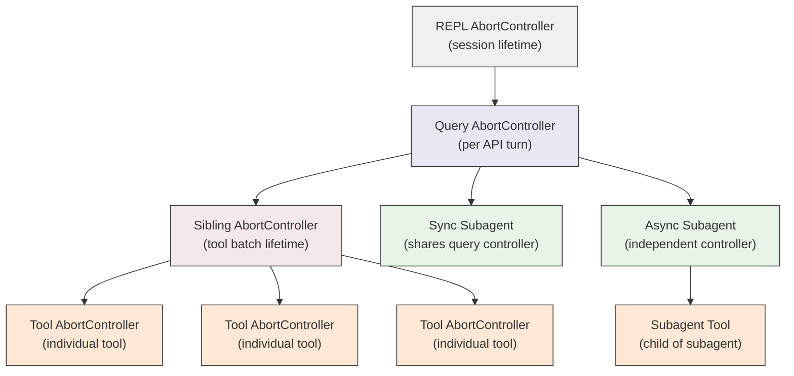

# Abort and Cancellation

In a long-running agent session, cancellation can happen at many levels. The user presses Ctrl+C. A Bash command exits with an error. A subagent gets killed. A session times out. A user types a new message while the agent is still responding.

Each of these events should stop *some* work, but not necessarily *all* work. A failed Bash command should kill its sibling tools but not end the conversation. A user interrupt should stop the current response but keep the session alive. A full cancellation should tear everything down.

The question, then, is how to encode these boundaries. Which things should stop when X happens? The answer in Claude Code is an **AbortController tree** -- a hierarchy of controllers where abort signals propagate downward (parent to child) but never upward (child to parent).

## The AbortController Tree

JavaScript's built-in `AbortController` is a simple mechanism: create a controller, pass its signal to async operations, and call `abort()` when you want to cancel them. But a single controller is too coarse for an agent system. You need a *hierarchy*.

In a typical Claude Code session, the tree looks like this:



The key property: aborting a parent aborts all its descendants. Aborting a child affects only that child. This is what makes it possible to cancel a single tool without ending the query, or cancel the query without ending the session.

## Parent-to-Child Propagation with WeakRef

The implementation lives in `src/utils/abortController.ts`. Two functions do most of the work: `createAbortController` (a factory that sets up proper listener limits) and `createChildAbortController` (the core of the hierarchy).

```typescript
// src/utils/abortController.ts (lines 68-99)
export function createChildAbortController(
  parent: AbortController,
  maxListeners?: number,
): AbortController {
  const child = createAbortController(maxListeners)

  // Fast path: parent already aborted, no listener setup needed
  if (parent.signal.aborted) {
    child.abort(parent.signal.reason)
    return child
  }

  // WeakRef prevents the parent from keeping an abandoned child alive.
  const weakChild = new WeakRef(child)
  const weakParent = new WeakRef(parent)
  const handler = propagateAbort.bind(weakParent, weakChild)

  parent.signal.addEventListener('abort', handler, { once: true })

  // Auto-cleanup: remove parent listener when child is aborted
  child.signal.addEventListener(
    'abort',
    removeAbortHandler.bind(weakParent, new WeakRef(handler)),
    { once: true },
  )

  return child
}
```

There are three things worth noting here.

**One-way propagation.** When the parent aborts, the handler fires and aborts the child. But when the child aborts, it only removes its listener from the parent -- it does not propagate upward. This asymmetry is the foundation of the entire cancellation model.

**WeakRef for memory safety.** The parent holds only a `WeakRef` to the child controller. If all strong references to a child are dropped (say, a tool finishes and its controller goes out of scope), the child can be garbage collected even though the parent still has a listener referencing it. The listener becomes a harmless no-op pointing at a dead WeakRef.

**Auto-cleanup on child abort.** When a child is aborted -- from any source -- it removes its listener from the parent signal. This prevents listener accumulation. Without this, a long session that creates hundreds of child controllers (one per tool invocation) would pile up dead listeners on the parent.

## The Sibling Abort Pattern

The `StreamingToolExecutor` (`src/services/tools/StreamingToolExecutor.ts`) uses a pattern that demonstrates why this hierarchy matters. When the model emits multiple tool calls, the executor creates a **sibling abort controller** -- a child of the query's abort controller:

```typescript
// src/services/tools/StreamingToolExecutor.ts (lines 46-62)
// Child of toolUseContext.abortController. Fires when a Bash tool errors
// so sibling subprocesses die immediately instead of running to completion.
// Aborting this does NOT abort the parent — query.ts won't end the turn.
private siblingAbortController: AbortController

constructor(/* ... */) {
  this.siblingAbortController = createChildAbortController(
    toolUseContext.abortController,
  )
}
```

Each individual tool then gets its *own* child controller, parented to the sibling controller:

```typescript
// src/services/tools/StreamingToolExecutor.ts (lines 301-302)
const toolAbortController = createChildAbortController(
  this.siblingAbortController,
)
```

When a Bash command fails, the executor aborts the sibling controller with a specific reason:

```typescript
// src/services/tools/StreamingToolExecutor.ts (lines 358-362)
if (tool.block.name === BASH_TOOL_NAME) {
  this.hasErrored = true
  this.erroredToolDescription = this.getToolDescription(tool)
  this.siblingAbortController.abort('sibling_error')
}
```

This kills all other running tools in the batch (they are children of the sibling controller). But it does *not* abort the query controller (the sibling controller's parent). So the query loop continues: it collects the error results from the aborted tools, sends them back to the API, and lets the model decide what to do next.

Only Bash errors trigger sibling abort. File reads, web fetches, and other tools are independent -- one failure does not imply the others are pointless. Bash commands, on the other hand, often have implicit dependency chains (`mkdir` fails, so subsequent commands are pointless).

## Interrupt vs. Full Cancellation

Not all aborts are the same. Claude Code distinguishes between two kinds by using the abort signal's `reason` field:

- **Interrupt** (`reason === 'interrupt'`): The user typed a new message while the agent was still responding. The current work should stop, but the session continues. The new message will be processed next.
- **Full cancellation** (any other reason, or no reason): The session is ending. Ctrl+C, explicit cancel, timeout.

The query loop in `src/query.ts` checks this distinction:

```typescript
// src/query.ts (line 1044-1051)
// Skip the interruption message for submit-interrupts — the queued
// user message that follows provides sufficient context.
if (toolUseContext.abortController.signal.reason !== 'interrupt') {
  yield createUserInterruptionMessage({
    toolUse: false,
  })
}
return { reason: 'aborted_streaming' }
```

When the abort reason is `'interrupt'`, the query skips the interruption message. The user's new message provides the context for the next turn -- there is no need to tell the model "you were interrupted." For a full cancellation, the interruption message is included so the conversation history reflects what happened.

The same distinction appears in the `ShellCommand` class (`src/utils/ShellCommand.ts`), where an interrupt-aborted process is handled differently from a hard-killed one.

## Listener Limits

Node.js warns when more than 10 listeners are attached to a single event emitter. In an agent session with dozens of concurrent tools, child controllers, and subagents, this limit is quickly exceeded. The `createAbortController` wrapper addresses this:

```typescript
// src/utils/abortController.ts (lines 16-22)
export function createAbortController(
  maxListeners: number = DEFAULT_MAX_LISTENERS,
): AbortController {
  const controller = new AbortController()
  setMaxListeners(maxListeners, controller.signal)
  return controller
}
```

The default is 50 listeners. This is high enough for typical sessions (a query with 10+ concurrent tools, each creating a child controller) without being so high that genuine listener leaks go undetected.

:::tip
Cancellation in async systems is fundamentally about defining boundaries: what should stop when X happens? The AbortController tree encodes these boundaries explicitly. Each `createChildAbortController` call is a declaration: "this work is scoped to that work, but not vice versa."
:::

## Key Takeaways

- **AbortControllers form a tree**, not a flat list. Parent abort propagates to all children; child abort is isolated. This hierarchy encodes which work should stop when a particular cancellation event fires.
- **WeakRef prevents memory leaks** from abandoned child controllers. When a tool finishes and its controller goes out of scope, it can be garbage collected even though the parent still has a listener referencing it.
- **The sibling abort pattern** lets a failed Bash command kill parallel tools without ending the query. The query loop collects error results and lets the model recover.
- **Abort reasons distinguish interrupt from cancellation.** The string `'interrupt'` means "stop current work, session continues." Anything else means "tear it all down." This distinction flows through the query loop, tool execution, and shell command handling.
- **Listener cleanup is automatic.** Child controllers remove their parent listeners on abort, preventing accumulation over long sessions with hundreds of tool invocations.
