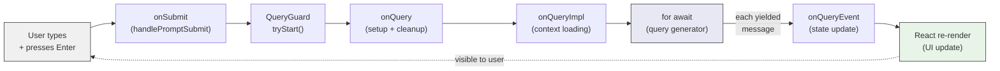

# REPL Orchestration

The REPL is where two very different programming models meet. On one side: the `query()` generator from Module 2 -- an imperative, step-by-step iteration through API calls, tool executions, and follow-up decisions. On the other side: React -- a declarative rendering system where you describe what the UI *should* look like, and the framework figures out how to make it so.

Bridging these two worlds is the central challenge of the REPL component. It is a ~5000-line React component (`src/screens/REPL.tsx`) that manages the full lifecycle: from the moment a user presses Enter, through the query loop's execution, to the final rendered message.

## The Flow: From Keystroke to Rendered Message

When a user types a message and submits it, the path through the code touches three key functions:

1. **`onSubmit`** -- The entry point. Handles input validation, slash command detection, and delegates to `handlePromptSubmit` for the heavy lifting (attachment processing, mode detection, telemetry).

2. **`onQuery`** -- Sets up the query turn. Manages the concurrency guard, appends new messages to state, and calls `onQueryImpl`. Its `finally` block ensures cleanup happens even if the query throws.

3. **`onQueryImpl`** -- The core. Builds system prompts, loads context, and runs the `for await` loop over the `query()` generator. Each yielded message updates React state, triggering a re-render.

Here is the critical loop:

```typescript
// src/screens/REPL.tsx (lines 2793-2803)
for await (const event of query({
  messages: messagesIncludingNewMessages,
  systemPrompt,
  userContext,
  systemContext,
  canUseTool,
  toolUseContext,
  querySource: getQuerySourceForREPL()
})) {
  onQueryEvent(event);
}
```

This is the bridge. The `query()` generator yields messages imperatively -- one at a time, as they become available. The `onQueryEvent` callback pushes each message into React state. Each push triggers a re-render. The generator controls the *flow*; React controls the *display*.



## The QueryGuard: One Query at a Time

What happens if the user presses Enter while a query is already running? This is not hypothetical -- it happens frequently. Users type follow-up thoughts, or interrupt with corrections. The system needs a clear answer: either queue the message or interrupt the current query.

The `QueryGuard` class (`src/utils/QueryGuard.ts`) is a synchronous state machine that enforces single-query execution:

```typescript
// src/utils/QueryGuard.ts (lines 29-67)
export class QueryGuard {
  private _status: 'idle' | 'dispatching' | 'running' = 'idle'
  private _generation = 0

  reserve(): boolean {
    if (this._status !== 'idle') return false
    this._status = 'dispatching'
    this._notify()
    return true
  }

  tryStart(): number | null {
    if (this._status === 'running') return null
    this._status = 'running'
    ++this._generation
    this._notify()
    return this._generation
  }

  end(generation: number): boolean {
    if (this._generation !== generation) return false
    if (this._status !== 'running') return false
    this._status = 'idle'
    this._notify()
    return true
  }
}
```

Three states: `idle` (nothing running), `dispatching` (a queued item was dequeued, async chain hasn't reached `onQuery` yet), and `running` (query is executing). The `generation` counter handles a subtle race: if a query is cancelled and a new one starts before the old one's `finally` block runs, the stale `end()` call sees a generation mismatch and skips cleanup.

When `onQuery` is called while a query is already running, it extracts the user's text and enqueues it:

```typescript
// src/screens/REPL.tsx (lines 2868-2885)
const thisGeneration = queryGuard.tryStart();
if (thisGeneration === null) {
  // Extract and enqueue user message text, skipping meta messages
  newMessages
    .filter((m): m is UserMessage => m.type === 'user' && !m.isMeta)
    .map(_ => getContentText(_.message.content))
    .filter(_ => _ !== null)
    .forEach((msg, i) => {
      enqueue({ value: msg, mode: 'prompt' });
    });
  return;
}
```

The queued message will be processed after the current query completes. This is safer than trying to interrupt mid-tool-execution -- the current turn finishes cleanly, and the queued message becomes the next turn's input.

## State Management

The REPL manages a significant amount of state. Key categories include:

**Conversation state.** The `messages` array is the source of truth for the entire conversation history. Every API call, tool result, system message, and user input is stored here. `setMessages` updates it, and a `messagesRef` provides synchronous access (avoiding React's batching delays).

**Loading and streaming state.** `streamMode` tracks whether the agent is requesting, responding, or executing tools. `streamingToolUses` tracks in-progress tool calls for real-time UI updates. `streamingThinking` manages extended thinking display with a 30-second auto-hide timer.

**Abort controller.** Stored in both `useState` (for React rendering) and a ref (for imperative access by the REPL bridge when remote interrupts arrive).

**The QueryGuard.** Derives `isLoading` via `useSyncExternalStore`, giving React a synchronous, consistent view of whether a query is active -- no batching delays, no stale closures.

The sheer number of `useState` hooks (30+) is not accidental. Each piece of state has a specific update frequency and a specific set of consumers. Combining them into a single state object would cause unnecessary re-renders -- updating the streaming text (which changes every ~50ms during response generation) would re-render components that only care about the message list.

## Bridging Imperative and Declarative

The fundamental tension is worth dwelling on. The `query()` generator is *imperative*. It says: "First, call the API. Then, check if the model wants to use tools. If so, run them. Then call the API again. Repeat." It is sequential, step-by-step, with explicit control flow.

React is *declarative*. It says: "Given these messages, render this UI." It does not care about the order in which messages arrived. It does not know about API calls or tool execution. It just renders the current state.

The bridge is the `for await` loop in `onQueryImpl`. On each iteration:

1. The generator yields a message (an API response, a tool result, a progress update).
2. `onQueryEvent` dispatches the message to the appropriate state setter -- `setMessages` for conversation messages, `setStreamingText` for streaming deltas, `setStreamingToolUses` for in-progress tools.
3. React re-renders with the updated state.
4. The loop continues to the next yield.

This means the generator drives the *pace* of updates, and React drives the *rendering*. The generator does not know or care about the UI. React does not know or care about the query loop. The `for await` loop is the seam between them.

## Supporting Systems

The REPL orchestrates several supporting systems beyond the core query loop:

**Cost tracking.** API metrics (time to first token, output tokens per second) are collected per-request and aggregated per-turn. For multi-request turns (tool use loops), the REPL computes P50 across all requests.

**Session title generation.** On the first real user message, a background Haiku call generates a session title. A ref (`haikuTitleAttemptedRef`) ensures this only happens once, and synthetic messages (slash command output, skill expansions) are filtered out so the title reflects the user's actual topic.

**Session persistence.** Messages are written to transcript storage as they arrive, enabling resume-on-restart. Content replacements (large tool results stored on disk instead of in memory) are tracked per-agent and cleaned up on agent completion.

**Notification system.** Hook results, background task completions, and system warnings are queued and displayed through the REPL's notification infrastructure.

## Key Takeaways

- **The REPL bridges imperative and declarative worlds.** The `query()` generator is imperative (step-by-step execution). React is declarative (render current state). The `for await` loop in `onQueryImpl` is the seam: each yielded message becomes a state update that triggers a re-render.
- **The QueryGuard enforces single-query execution** with a three-state machine (`idle` / `dispatching` / `running`). Generation counters handle cancel-and-resubmit races where stale `finally` blocks fire after a new query has started.
- **State is deliberately granular.** 30+ `useState` hooks are not a code smell -- they prevent unnecessary re-renders. Streaming text updates every ~50ms; the message list updates once per yielded message. Different frequencies, different state atoms.
- **Refs bridge React's async batching with imperative needs.** `messagesRef` provides synchronous access to the latest messages. `abortControllerRef` lets the REPL bridge abort the active query without waiting for a re-render.
